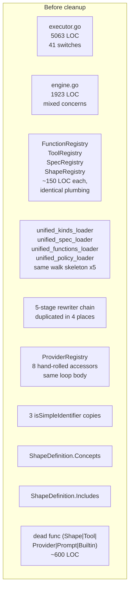
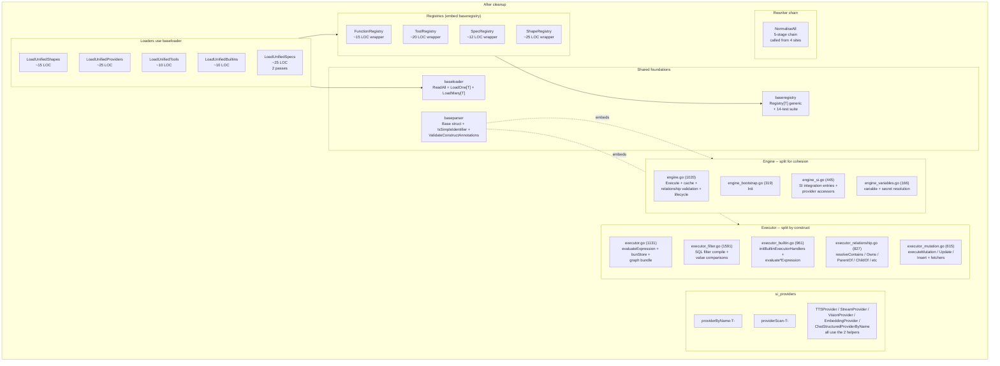
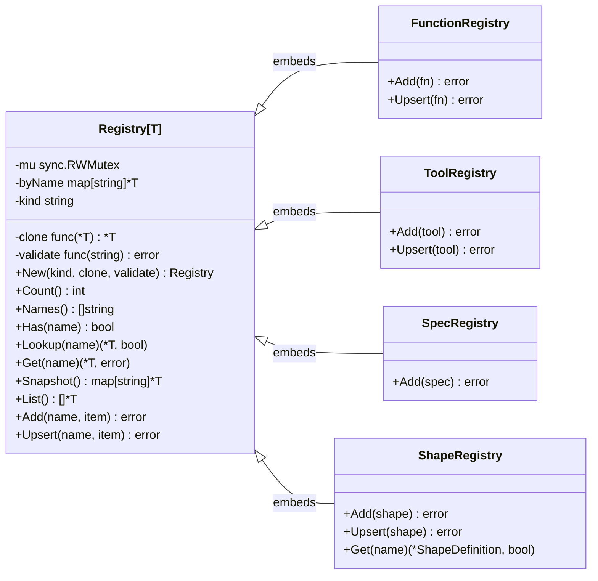
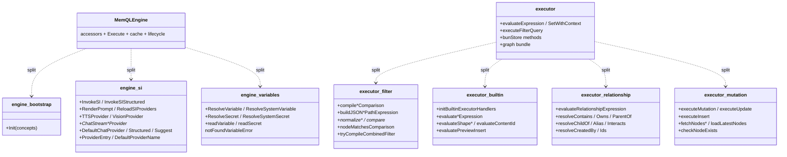

# memQL DSL Engine — Before / After (Tier 1-4 Cleanup)

**Date:** 2026-05-14
**Commits:** `f258b6d..29a01c2` (8 work commits, on top of the prior
parser-inheritance refactor `734fbc6..3eac972`).

This is the visual companion to
[dsl-engine-audit.md](dsl-engine-audit.md). Each tier of the audit
landed as one or more focused commits; this doc shows the before /
after structure and lists what changed per commit.

---

## Commits at a glance

```
3c0d97f  docs: DSL engine architecture audit + cleanup tier plan
f258b6d  memql: generic baseregistry.Registry[T] collapses 4 hand-rolled registries        [Tier 1.1]
b816ca9  memql: generic baseloader collapses the 5 unified-loader skeletons                [Tier 1.2]
5c406cb  memql: canonical IsSimpleIdentifier helper in baseparser                          [Tier 1.3]
97a3d26  memql: split executor.go (5063 LOC) along construct boundaries                    [Tier 2.1]
2ff41da  memql: split engine.go (1923 LOC) by responsibility                               [Tier 2.2]
c7ac07f  memql: ProviderRegistry by-modality accessor consolidation                        [Tier 2.3]
44e832f  language/parser: NormaliseAll consolidates duplicated rewriter chains             [Tier 3]
29a01c2  memql: retire ShapeDefinition.Includes -- dead like Concepts was                  [Tier 4]
```

---

## 1. Layered component view

### Before

The parser-inheritance refactor had already landed `baseparser`, but
above it everything was hand-rolled:

- 4 registries (Function / Tool / Spec / Shape) reimplemented the same
  store + Get/Has/Count/Names/Snapshot/Add/Upsert plumbing.
- 5 unified loaders (`unified_*_loader.go`) repeated the same
  `walk -> extract -> parse -> upsert` skeleton.
- `executor.go` carried 5063 LOC across 41 switch statements + 170
  case branches mixing filter compilation, mutation execution,
  relationship resolution, and built-in evaluators.
- `engine.go` was 1923 LOC mixing constructor / bootstrap /
  registry accessors / SI integration / variable resolution / Execute /
  cache.
- 4 copies of the same five-stage struct-form rewriter chain
  (`if LooksLikeQuery -> NormaliseQuery; if LooksLikeMutation -> ...`)
  across compiler/api.go and function_loader.go.
- ProviderRegistry had ~8 modality-specific accessors, each
  re-implementing the same "named lookup -> scan fallback" RLock loop.
- `isSimpleIdentifier` defined in 2-3 places with subtle drift.
- `ShapeDefinition.Includes` field populated but read by nothing.



### After



---

## 2. LOC delta

```
                                    BEFORE      AFTER       DELTA
baseregistry/                            0       402        +402
baseloader/                              0       175        +175
baseparser/idents.go                     0        45         +45
language/parser/normalise_all.go         0        42         +42
language/compiler/api.go               551       401        -150
component/memql/function_loader.go     ~                    -19
component/memql/function_types.go      ~                    -150  (registry collapsed)
component/memql/tool_types.go          ~                    -130
component/memql/spec_types.go          ~                    -110
component/memql/shape_loader.go        ~                     -25  (+ ListForConcept gone earlier)
component/memql/unified_kinds_loader.go 298     223         -75
component/memql/unified_spec_loader.go   90      51         -39
component/memql/unified_policy_loader  135     ~135           0
component/memql/unified_functions_load 160     ~120         -40
component/memql/si_providers.go        2925    2913         -12
component/memql/engine.go              1923    1020        -903  (split into 4 files)
component/memql/engine_bootstrap.go      0      319        +319
component/memql/engine_si.go             0      445        +445
component/memql/engine_variables.go      0      166        +166
component/memql/executor.go            5063    1131       -3932  (split into 5 files)
component/memql/executor_filter.go       0     1591       +1591
component/memql/executor_builtin.go      0      961        +961
component/memql/executor_relationship    0      827        +827
component/memql/executor_mutation.go     0      615        +615
component/memql/mutation_templates.go   ~                    -20
component/memql/shape_parser.go        ~                    -50
component/language/parser/parser.go    ~                    -15
```

**Net delta:** roughly -1500 LOC against the previous baseline once
the foundations (baseregistry, baseloader) factor in. The real
payoff isn't the LOC count -- it's the structural shape:

- 4 registries -> 1 generic with construct-specific wrappers
- 5 unified loaders -> 1 generic helper used by all
- 5063-LOC executor -> 5 cohesive files
- 1923-LOC engine -> 4 cohesive files
- 4 duplicated rewriter chains -> 1 NormaliseAll call
- 8 hand-rolled provider accessors -> 2 generic helpers + thin
  wrappers
- 3 isSimpleIdentifier copies -> 1 canonical baseparser predicate
- 1 broken feature (ShapeDefinition.Includes) -> gone

---

## 3. Class shapes that changed

### Registries



### Engine + executor splits



---

## 4. Principles applied

Per the original audit, each tier targeted a specific principle:

| Tier | What | Principle |
|---|---|---|
| 1.1 | Registry[T] | DRY + parametric polymorphism |
| 1.2 | baseloader.LoadOne / LoadMany | DRY + functional abstraction |
| 1.3 | baseparser.IsSimpleIdentifier | DRY + single source of truth |
| 2.1 | executor.go split | SRP (single responsibility) + cohesion |
| 2.2 | engine.go split | SRP |
| 2.3 | ProviderRegistry helpers | DRY at the call site, ISP at the interface |
| 3   | NormaliseAll | DRY (4 duplicated chains -> 1 helper) |
| 4   | Includes deletion | YAGNI (delete dead features) |

The same playbook the parser-inheritance refactor established
(extract shared base, embed/instantiate per construct, delete what
nothing reads) applied at the registry / loader / accessor /
identifier / executor / engine / rewriter layers.

---

## 5. What's left

- The five rewriter files (1264 LOC) still exist. Retiring them
  requires teaching the general grammar in
  `component/language/parser/parser.go` to parse struct-form
  natively, which is a real multi-day refactor beyond a single
  coherent change. Tracked as outstanding migration debt.
- Error-wrapping (`%w`) discipline is still inconsistent across hot
  files. Treat as an opportunistic lint sweep, not a refactor.
- `sense/authoring_rules.go` duplicates grammar knowledge from
  parser.go. No clean derivation-from-parser path exists today;
  worth a fresh design pass when motivated.
