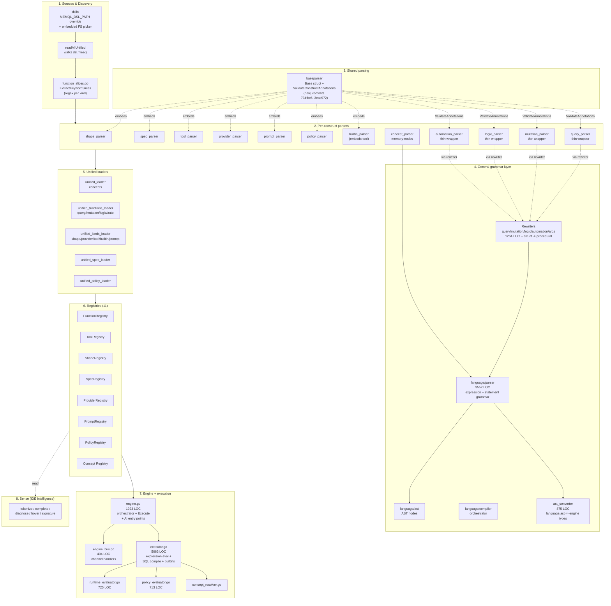
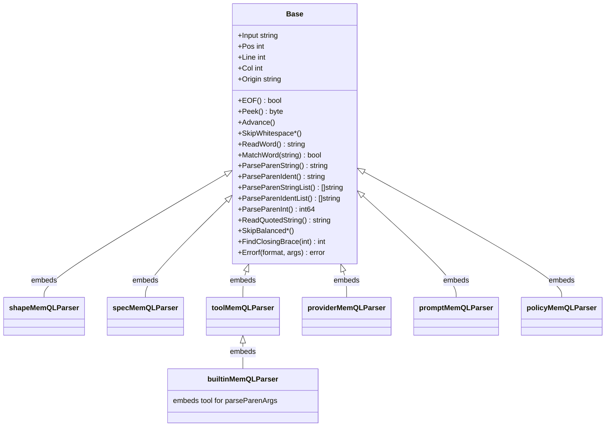

# memQL DSL Engine — Architecture + Cleanup Audit

**Date:** 2026-05-14
**Scope:** `component/memql/**`, `component/memql/baseparser/`, `component/memql/sense/`,
`component/language/**`, `component/database/memory-nodes/concept_parser.go`.
Roughly **50 KLOC** of Go split across ~110 files.

Out of scope: `integrations/`, `dsl/` (`.memql` content), gRPC handlers,
identity, transport, server glue.

---

## 1. Component diagram

The engine is a strict pipeline: `.memql` text on disk -> per-construct
parsers -> registries -> the execute path. Each layer below depends
*upward* on the next.



Solid arrows are data flow; dotted are dependencies / cross-cuts.

---

## 2. What just landed: parser inheritance refactor

Eight work commits (`734fbc6..2666c7f`) + a doc-fix (`2a5e1be`) + a
follow-on dead-code cleanup (`3eac972`). Together: **-2700 LOC** net
in the parser stack.

### Before / after class shape



Before: each of six parsers re-implemented the same ~250 LOC of
scanning primitives with subtle drift. After: one canonical
implementation in `baseparser.Base`; each parser carries only
construct-specific grammar. Plus dead `func (Shape|Tool|Provider|
Prompt|Builtin)` legacy handlers got deleted (~700 LOC) along with
the broken `ShapeDefinition.Concepts` feature path.

**Principles applied:** DRY (deduplicate primitives), SRP (parser
owns only its construct's grammar), composition-over-inheritance
(Go embedding), no-backwards-compat (delete legacy `func` machinery
cleanly).

---

## 3. Cleanup opportunities (prioritized)

Same kind of work, different parts of the engine. Each item below
cites concrete files + line ranges so the next pass can start fast.

### Tier 1 — Bounded, high-value (same shape as parser refactor)

These are the closest analogs to the parser work: clear duplication,
small blast radius, can be done in one focused commit each.

#### 1.1 Generic `Registry[T]` to collapse 5 hand-rolled registries

**Files:** [function_types.go:238-375](component/memql/function_types.go),
[tool_types.go:290-430](component/memql/tool_types.go),
[spec_types.go:91-190](component/memql/spec_types.go),
[shape_loader.go:43-120](component/memql/shape_loader.go),
plus PromptRegistry + ProviderRegistry (partial fit).

Each registry hand-rolls the same `sync.RWMutex + map[string]*T`
plus `New / Get / Has / Count / Names / Snapshot / Upsert / add`.
Go 1.18+ generics let one parametric type replace ~1500 LOC of
near-identical code:

```go
// component/memql/baseregistry/registry.go
type Named interface { GetName() string }
type Registry[T Named] struct { ... }
func New[T Named]() *Registry[T]
func (r *Registry[T]) Get(name string) (T, error)
func (r *Registry[T]) Upsert(item T) error
// ... etc
```

`FunctionRegistry`, `ToolRegistry`, `SpecRegistry`, `ShapeRegistry`
become type aliases or thin wrappers. **PolicyRegistry +
PromptRegistry deviate today** (different method names: `Lookup`,
`All`, etc.) -- normalize them in the same pass.

**Estimated delta: -1200 to -1500 LOC.**

#### 1.2 Generic unified-loader factory

**Files:** [unified_kinds_loader.go](component/memql/unified_kinds_loader.go) (298 LOC),
[unified_spec_loader.go](component/memql/unified_spec_loader.go) (90 LOC),
[unified_policy_loader.go](component/memql/unified_policy_loader.go) (95 LOC),
[unified_functions_loader.go](component/memql/unified_functions_loader.go) (160 LOC).

Every loader has the exact same skeleton:

```go
for raw := range readAllUnified(logger) {
    for slice := range ExtractKeywordSlices(raw.content, "<kind>") {
        item, err := parseXMemQL("unified:"+raw.path+":"+slice.Name, []byte(slice.Source))
        // ... err handling
        registry.Upsert(item)
        total++
    }
}
```

Hoist to a generic loader:

```go
// component/memql/baseparser/loader.go (or similar)
func LoadKind[T any](
    logger *slog.Logger,
    keyword string,
    parse func(origin string, raw []byte) (T, error),
    upsert func(T) error,
) (int, error)
```

`LoadUnifiedShapes`, `LoadUnifiedProviders`, `LoadUnifiedTools`,
`LoadUnifiedBuiltins`, `LoadUnifiedPrompts`, `LoadUnifiedSpecs`,
`LoadUnifiedPolicies` all become 3-line wrappers. **Estimated
delta: -400 to -500 LOC.**

#### 1.3 Canonical identifier validator

**Files:** [mutation_templates.go:1168-1180](component/memql/mutation_templates.go),
[language/parser/parser.go:5269-5275](component/language/parser/parser.go).

Two near-identical implementations of `[A-Za-z_][A-Za-z0-9_]*`:
- `isSimpleIdentifier` in mutation_templates.go
- `isSimpleIdentifierSegment` in language/parser/parser.go

Plus `isIdentifierStart` / `isIdentifierChar` (rune-based variants)
in parser.go. Previously also lived in shape_parser.go (deleted in
the cleanup commit).

Hoist one canonical helper -- likely on `baseparser` since it's
already the shared scanning module. **Estimated delta: trivial LOC
but removes a real source of drift.**

### Tier 2 — Larger structural splits

These need more thought (clear blast radius, but they're big files
people grep often). Worth doing but plan the cuts before swinging.

#### 2.1 Split `executor.go` (5063 LOC, 170 case statements, 41 switches)

[executor.go](component/memql/executor.go) is the single biggest
file in the engine. The top-level functions break cleanly along
construct concerns -- they were just never separated:

- **Expression evaluation:** `evaluateExpression`, `evaluateExpressionSet`,
  `evaluateExpressionSetWithContext`, `evaluateRelationshipExpression`
- **Filter / SQL compilation:** `tryCompileCombinedFilter`,
  `executeCombinedFilterQuery`, `compileComparisonExpressionWithContext`,
  `compileConceptComparison`, `compileIdComparison`, `compileTypeComparison`,
  `compileCreatedByComparison`, `compileCreatedAtComparison`,
  `compilePayloadComparison`, `buildJSONPathExpression`,
  `buildJSONBPathExpression`, `sqlOperatorForComparison`
- **Mutation execution:** `evaluateShapeTemplatesExpression`,
  the mutation paths under `insert/update`
- **Builtin dispatch:** `initBuiltinExecutorHandlers` + its 40-case
  handler table
- **AI integration:** the AI-call portions at the bottom of the file

Proposed split:
```
executor_filter.go    -- compile* + buildJSON* + sqlOperator*
executor_query.go     -- evaluateExpression*
executor_mutation.go  -- evaluateShape* + mutation eval
executor_builtin.go   -- initBuiltinExecutorHandlers + dispatch
executor_ai.go        -- AI invocation paths
executor.go           -- shared helpers + receiver definitions
```

No behavior change; just stable file boundaries that make the
review surface tractable. **Estimated post-split: 6 files of
500-900 LOC each.**

#### 2.2 Split `engine.go` (1923 LOC)

[engine.go](component/memql/engine.go) mixes:
- Constructor + Phase 2/3 bootstrap
- Registry accessors (Shapes, Specs, Providers, etc. -- thin
  getters)
- Execute() + plan resolution + cache
- AI integration entry points (`InvokeAI`,
  `InvokeAIChatWithTools`)
- Variable + secret resolution

The Execute() path stays in engine.go. The other concerns split out:
```
engine_bootstrap.go     -- New + LoadXXX wiring
engine_accessors.go     -- thin Shapes()/Specs()/Providers() etc.
engine_ai.go            -- InvokeAI + InvokeAIChatWithTools
engine_variables.go     -- variable + secret resolution
engine.go               -- Execute + plan cache + lifecycle
```

#### 2.3 `ProviderRegistry` by-modality accessor consolidation

**File:** [ai_providers.go:319-700](component/memql/ai_providers.go).

The registry has 8 modality-specific accessors:
`TTSProvider`, `TTSProviderByName`, `ChatProvider`,
`ChatStructuredProvider`, `ChatStructuredProviderByName`,
`SuggestChatProvider`, `StreamProvider`, `VisionProvider`,
`EmbeddingProvider`. Each is ~30 LOC of the same lookup +
default-fallback shape, differing only by the type assertion.

A single generic `Get[I](modality, name) (I, error)` would collapse
this. The interfaces themselves stay (ISP -- different modalities
genuinely have different surface).

The provider INTERFACES are fine as-is (6+ siblings with real
type differences); the registry ACCESSORS that wrap them are
where the consolidation lives. **Estimated delta: -150 to -200 LOC.**

### Tier 3 — Migration debt to retire eventually

#### 3.1 The five rewriter files (1264 LOC)

**Files:** [language/parser/query_rewrite.go](component/language/parser/query_rewrite.go) (322 LOC),
[mutation_rewrite.go](component/language/parser/mutation_rewrite.go) (327),
[logic_rewrite.go](component/language/parser/logic_rewrite.go) (161),
[automation_rewrite.go](component/language/parser/automation_rewrite.go) (292),
[args_rewrite.go](component/language/parser/args_rewrite.go) (162).

These translate the canonical struct form (`query NAME { args, filter,
shape }`) into the procedural form (`func (Query) NAME(ctx) { return
<expr>, nil }`) that the general grammar parser actually understands.

The parser-refactor handoff doc explicitly said don't retire these --
multi-day work, low payoff today. **But:** they ARE migration debt.
The long-term move is to teach the general grammar to read the struct
form directly, and the four `*_parser.go` thin wrappers become parsers
proper.

Recommended posture: leave alone for now, but track for retirement
once a clear motivating reason arrives (new construct kind that
also wants the rewriter pattern -- that's the moment to invest in
struct-form-native parsing instead of adding a sixth rewriter).

#### 3.2 `concepts_only_extractor.go`

**File:** [concepts_only_extractor.go](component/memql/concepts_only_extractor.go) (72 LOC).

Regex-based concept extractor that bypasses the language parser
"to avoid rewriter limitations." Active today but explicitly a
workaround; once the rewriter retirement decision lands, this can
likely go with it.

### Tier 4 — Cross-cutting consistency

#### 4.1 Error wrapping (`%w`) discipline

Audit results: executor.go wraps 46/189 errors (24%), parser.go
wraps 5/37 (14%), engine.go wraps 13/60 (22%). Most errors lose
their cause chain, defeating `errors.Is/As` at the boundary.

Not a refactor in the structural sense -- more of a sweep with a
linter rule. But the cost of inconsistent wrapping is real:
debugging an error 3 layers deep means string-matching the message
instead of unwrapping cleanly.

Recommended: add a lint check (custom analyzer or
`errwrap`/`wrapcheck`) and fix the highest-traffic call sites
opportunistically.

#### 4.2 `ShapeDefinition.Includes` -- likely dead like Concepts was

**File:** [shape_loader.go:36-40](component/memql/shape_loader.go).

The cleanup commit's comment on this field: "lists shapes whose
fields are merged into this shape at load time." But after the
include-resolver was deleted in earlier work, no code populates
the merged result. Same shape as the just-deleted `Concepts`
broken-feature pattern. Worth a `grep -rn 'Includes' component/`
audit before the next pass.

#### 4.3 Sense layer's authoring_rules.go (276 LOC)

**File:** [sense/authoring_rules.go](component/memql/sense/authoring_rules.go).

Hardcodes grammar/nesting rules for IDE completion. Risk: drifts
from the actual grammar in language/parser/parser.go silently. Not
clearly broken today, but a "rules live in two places" smell --
the canonical grammar lives in the parser, and the IDE rules are
a hand-maintained shadow. Worth thinking about whether sense can
derive its rules from the parser introspection rather than
duplicating.

---

## 4. Recommended next pass

If you want one focused cleanup commit next, do **Tier 1.1
(generic Registry[T])**. Highest LOC payoff, identical pattern to
the parser refactor (extract shared base, embed/instantiate per
construct), no behavior change, naturally tested by existing
loader smoke tests.

If you want a less risky warm-up, do **Tier 1.3 (canonical
identifier validator)** -- trivial LOC, removes a real source of
drift, sets up the pattern for the bigger registry generification.

If you want the biggest readability win, do **Tier 2.1 (split
executor.go)** -- the largest single file becomes 6 right-sized
files, no logic changes. Pure structural improvement.

The Tier 3 rewriter retirement is a real piece of work; defer
until the next time something motivates touching that layer.
