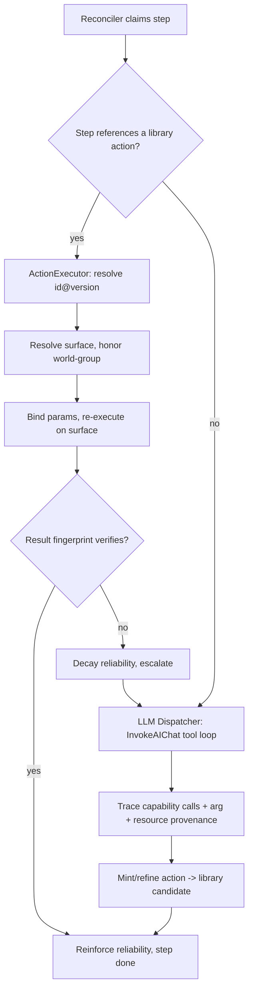

# Action library — reusable, replayable actions composed without an LLM

**Status:** Proposed. Not shipped.
**Priority:** High — this is the core MemQL thesis made operational: the harness
learns concrete actions once, then replays them token-free.
**Owner:** TBD.
**Related:**
[llm-driven-decisions.md](./llm-driven-decisions.md) (cache LLM decisions
intelligently — this doc is the action-level sibling of that idea),
[planner-observability.md](./planner-observability.md),
the harness spine (epic #590, foundational #582, reconciler #583, recall #585,
memory consolidation #586, planner #587).

> **This document deletes itself when Phases 0–5 ship and the action library is
> in steady state**, per the no-stale-docs convention.

---

## 1. Why this document exists

Today the harness spends LLM reasoning on *every* step of *every* plan. The
planner (#587) decomposes a goal into a step DAG; a specialist executes each
step by running `engine.InvokeAIChatWithFilteredToolsOpts` — a bounded
tool-calling loop where the model decides **which** tool calls to make with
**which** arguments. The concrete sequence the model produces is then thrown
away (kept only as `v1:harness:observation` embeddings for semantic recall).

That means the same logical work — "write this file," "scaffold a Go module,"
"run this command" — is re-reasoned from scratch on every run, at full token
cost, with the latency and nondeterminism of a model in the loop.

The goal of this work is a **growing, queryable library of reusable actions**.
The first time the LLM performs a piece of work, we capture it as a concrete,
parameterized **action**. From then on:

- The **planner composes plans by similarity-searching the action library**
  (pgvector) and wiring existing actions together — instead of reasoning each
  step from first principles.
- The **agent loop replays** a matched action by re-executing its concrete tool
  calls with bound parameters, **no LLM**.
- The **LLM only re-enters when execution fails or no action fits** — to adjust
  arguments, pick a different action, or mint a new one — and whatever it mints
  flows back into the library.

Intelligence is spent **once per novel action**, then amortized across every
future plan that needs something similar. The library compounds.

This is deliberately the same shape as the planner's *existing* agent
route/upgrade/provision loop (#587) — we run that retrieval-and-decide pattern
one level down, over **actions** instead of **agents**.

---

## 2. What already exists (the ~80%)

Most of the substrate is in the repo. This feature is mostly *wiring*, one new
concept, and one new abstraction (execution surfaces, §7) — not a greenfield
build.

| Capability we need | Already in the repo | Where |
| --- | --- | --- |
| Plan / step DAG, lifecycle state machine | `v1:harness:plan`, `v1:harness:step` (with `idempotencyKey`, `result`, `attempt`) | `dsl/harness/concepts.memql`, `component/memql/harness_step_validation.go` |
| Recording "what happened" | `v1:harness:observation` already captures `tool_result {toolName, args, result}` | `dsl/harness/concepts.memql`, `component/harness/reconciler.go` |
| LLM step execution (the cost) | `Dispatcher` → `InvokeAIChatWithFilteredToolsOpts` | `component/harness/reconciler.go`, `component/memql/ai_tool_loop.go` |
| Similarity-based reuse vs create | Planner agent route/upgrade/provision via cosine `fitScore` in pgvector; thresholds Route `0.82`, Upgrade `0.60`, Dedup `0.90` | `component/harness/planner.go`, `planner_logic.go`, `planner_adapters.go` |
| Confidence that grows on reinforcement, decays unused | `v1:harness:semanticMemory` (`confidence`, `reinforceCount`, `lastReinforced`, decay/prune) | `dsl/harness/concepts.memql`, consolidation #586 |
| Deterministic step executors (no LLM) | automation step types: `query`, `mutation`, `function`, `forEach`, `parallel`, `switch`, `automation`, `webhook` | `component/automations/`, `component/automations/steps/` |
| Content fingerprints / chain tracking / resume | `StepResult.ContentId`, `Automation.DefinitionFingerprint`, dedup, cluster guard | `component/automations/types.go`, `executor.go` |
| Execution surfaces to bind to | the **workbench** filesystem/shell, **computer-use** on connected machines, **MCP** tool servers | workbench runbook (`docs/public/operate/workbench-runbook.md`), computer-use + MCP integrations |
| Author → validate → durable promote lifecycle | `define` (session, non-durable) → `promote` (durable, owner-gated) | `component/memql/authoring_session.go`, `authoring_promote_durable.go`, `component/mcp/tool_surface.go` |
| Determinism replay check | `replay.go` (DAG-order verification with a no-op dispatcher) | `component/harness/replay.go` |
| Skill / capability bundle concept | `skill` concept (candidate home for composites) | `dsl/agents/concepts.memql` |

**The point:** embeddings + pgvector search, the reuse/create decision pattern,
confidence accrual, deterministic executors, fingerprint verification, the
promote lifecycle, and multiple execution surfaces are *all already here*. We
are connecting them around a new first-class object.

---

## 3. The gap, precisely

> **Record the *action*, not the *reasoning* — make it a reusable, retrievable,
> composable library object the planner draws on, and keep it portable across
> the surface it runs on.**

Five missing pieces:

1. **A first-class `action` object** — a concrete, parameterized, embedded,
   versioned, reliability-scored capability — as both **primitives** (a single
   capability call) and **composites** (a learned sequence of action references).
2. **A DSL surface** — a new `action` step type that references a library action
   by `id@version` and binds args, plus the `action` construct that *defines* a
   library entry.
3. **An `ActionExecutor`** that resolves an action and re-executes it (no LLM),
   with escalation back to the model on failure.
4. **A retrieval-augmented planner path** that searches the library and emits
   `action(...)` steps for hits, synthesizing (and contributing) new actions
   only for misses.
5. **Execution-surface decoupling** (§7) — an action names a *capability*, not a
   bound tool, so the same action can replay on the workbench, on a connected
   computer via computer-use, or on an MCP surface, with a resolver that binds
   the surface per action at replay time.

---

## 4. Core model: the action library

### 4.1 The `v1:actions:action` concept

A new namespace `actions`. One concept, discriminated by `kind`:

- **`primitive`** — the irreducible unit: exactly one **capability** call, with
  a parameter schema. Example: `writeFile`, `mkdir`, `runCommand`.
- **`composite`** — a learned subroutine: an ordered list of `action` references
  with a parameter schema that maps composite params down to child args.
  Example: `scaffoldGoModule` = `mkdir` + `writeFile` + `writeFile`.

Proposed fields (final names settled in Phase 1):

| Field | Type | Purpose |
| --- | --- | --- |
| `ownerUserId` | string @required | per-row authz (owned tier), stamped from actor |
| `slug` | string @required | human-readable name (`writeFile`) |
| `kind` | enum(`primitive`,`composite`) @required | discriminator |
| `intent` | string @required | natural-language description — **the embedding source** for retrieval |
| `capability` | string | (primitive) the abstract verb the action performs (`fs.writeFile`) — **not** a bound tool; the resolver maps it to a surface (§7) |
| `params` | object @required | parameter schema (name → type, required, default) |
| `argTemplate` | object | (primitive) capability arg template bound from `params` |
| `steps` | []object | (composite) ordered child action refs `{actionId, version, argTemplate, surfaceBinding?}` |
| `sideEffectClass` | enum(`read`,`write`,`exec`) @required | drives replay + trust gating |
| `recordedSurface` | string | provenance: the surface this action *was* recorded on (where it actually happened). Replay re-resolves; this is for audit, not binding |
| `reliability` | float @default(0.5) | confidence; rises on success, decays on failure (mirrors `semanticMemory`) |
| `reinforceCount` | int @default(0) | successful replays observed |
| `lastReinforced` | datetime | decay clock |
| `version` | int @required | monotonic; bumped on every edit |
| `status` | enum(`candidate`,`active`,`deprecated`) @required | trust ladder (see §9) |
| `provenancePlanId` / `provenanceStepId` | string | the run that minted it |
| `embedding` | []float | populated lazily from `intent` (same loop as observation embeddings) |

Because it is a MemoryNode we inherit time-ordered history, per-row authz,
provenance, and event emission for free — same as the harness spine.

### 4.2 Parameterization via data-flow tracing (automatic from day one)

When the specialist first performs a step, we mint an action. Its parameter
schema is derived by **provenance tracing, not synthesis**: at record time we
already hold the step's structured `input`, the plan input, and every upstream
step's `result`. For each argument value of each recorded capability call, we
trace its source:

- arg value equals a field in `step.input` / plan input / an upstream result →
  **bind it as a parameter** (e.g. `dirName → $params.dir`). We *observed* the
  data flow; we did not guess it.
- arg value is embedded inside a templated string → bind the fragment.
- arg value has no traceable source → **stays literal (a constant)**. We never
  invent a binding we did not witness.

We do **not** synthesize transforms (uppercasing, arithmetic). Those args stay
literal; if they actually depended on input, §11 verification catches it on the
next replay and re-records. As an action is reused with *different* inputs, a
value that used to be constant but now varies is promoted to a parameter — so
**actions generalize as they are used.**

The tracer also records **resource dependencies** (a read of a path an upstream
action wrote) — these become the world-group edges in §7.3.

### 4.3 Reliability and confidence

Reuse the `semanticMemory` pattern wholesale: `reliability` rises on a verified
successful replay (fingerprint match), decays when unused, and drops on failure.
Below a floor, an action is auto-`deprecated` and stops being offered to the
planner.

---

## 5. The DSL surface

Two additions: a way to **reference** an action from an automation step, and a
way to **define** a library action. Both slot next to the existing `function`
step type (`FunctionStepConfig` is just `Name` + `Args`; an action ref is that
plus version + library resolution).

### 5.1 The `action` step type (reference)

```
automation scaffoldThing {
  step writeConfig {
    action("act_writeFile@3")          // library id @ PINNED version
    args {
      path    = $input.dir + "/config.yaml"
      content = $steps.render.result
    }
    // surface binding is OPTIONAL; omitted = resolver decides (§7.2)
    on surface($input.targetSurface)   // explicit override when the caller cares
  }
}
```

`act_writeFile@3` pins version 3. Omitting `@3` (`action("act_fmt")`) is the
**floating opt-in** (§10). Omitting `on surface(...)` lets the resolver bind the
surface per action at replay time.

### 5.2 The `action` construct — a primitive

```
@kind("primitive")
@sideEffect("write")
@reliability(0.97)
action writeFile {
  capability "fs.writeFile"            // abstract verb, NOT a bound tool
  intent "Write a text file at a path with given content"   // embedded for search
  params {
    path    string @required
    content string @required
  }
  argTemplate { path: $params.path, content: $params.content }
}
```

Note what is *absent*: no surface. `writeFile` is "write a file" everywhere —
the resolver (§7) binds `fs.writeFile` to the workbench, computer-use, or an MCP
filesystem at replay time.

### 5.3 The `action` construct — a composite (learned subroutine, first-class)

```
@kind("composite")
action scaffoldGoModule {
  intent "Create a new Go module directory with go.mod and main.go"
  params { dir string @required; module string @required }
  steps {
    action("act_mkdir@1")     { args { path = $params.dir } }
    action("act_writeFile@3") { args { path = $params.dir + "/go.mod",  content = renderGoMod($params.module) } }
    action("act_writeFile@3") { args { path = $params.dir + "/main.go", content = stockMain() } }
  }
}
```

A composite and an automation use the **same** `action(...)` reference
construct. That is the keystone: "promote a successful composition into the
library" is literally lifting a run's step sequence into an `action` block — no
new machinery, and it reuses `define → promote` directly.

### 5.4 AST / compiler touchpoints

- `component/language/ast/ast.go`: add `StepTypeAction`, `ActionStepConfig
  {ActionId, Version *int, Args, SurfaceBinding *Expr}`; add an `ActionDef` node
  for the construct (with `Capability`, `ArgTemplate`).
- `component/language/compiler/`: lower `action(...)` to a runtime step carrying
  the resolved id + version + optional surface binding; lower `ActionDef` to a
  registered library entry.
- `component/memql/authoring_session.go`: teach `SplitBundleSource` and the
  function-family slicers about the `action` kind so define/promote handle it.

---

## 6. Execution: `ActionExecutor` + replay + escalation

A new step executor under `component/automations/steps/action.go`, registered in
the `StepExecutorRegistry`:

1. **Resolve** the action by `id@version` from the library registry.
2. **Resolve the surface** (§7) for this action — explicit binding > policy >
   availability fallback — honoring world-group constraints.
3. **Bind** params from the step's `args` (the data-flow bindings in reverse).
4. **Re-execute** (replay *does the real work*):
   - **primitive** → invoke the capability on the resolved surface with bound
     args. No LLM.
   - **composite** → walk `steps`, recursing into `ActionExecutor` for each
     child (each resolves its own surface, within world-group constraints).
5. **Prune reasoning-only calls.** A recorded call whose output nothing
   downstream consumed was read-for-reasoning; it is dropped on replay.
6. **Verify** the result fingerprint (§11). Match → reinforce `reliability`.
7. **Escalate on failure** → hand control back to the LLM dispatcher
   (`InvokeAIChatWithFilteredToolsOpts`) with context: the action, its bound
   args, the resolved surface, and the error. The model then either:
   - **adjusts arguments** (cheap) — re-bind and retry; or
   - **mints a replacement / new action** (expensive) — re-enters the record
     path and lands in the library; and
   - the failing action's `reliability` is decayed.

Deterministic replay by default, LLM strictly on the exception path.



---

## 7. Execution surfaces — capability vs. where it runs

An action is portable; *where* it runs is not part of its identity. "Write a
file on the workbench" and "write a file on my laptop via computer-use" are the
**same action** on **different surfaces**.

### 7.1 The split

- **Capability** — the abstract verb an action performs (`fs.writeFile`,
  `fs.readFile`, `shell.exec`) plus its param schema. Actions are defined
  against capabilities (§5.2), never against a bound tool.
- **Surface** — a concrete backend implementing capabilities: `workbench`,
  `computer-use:<machineId>`, `mcp:<server>`. (Name is **surface**/target, not
  `provider` — that DSL primitive is taken for LLM providers.) Each surface
  declares which capabilities it serves and whether it is currently available.

A new `v1:actions:surface` concept models the registry of available surfaces and
their capability coverage + availability. The `recordedSurface` field on an
action (§4.1) is provenance only — it records where the action *was* captured,
never constrains where it replays.

### 7.2 The resolver

At replay time, for **each action**, the resolver binds capability → surface in
this precedence:

1. **Explicit** step binding (`on surface(...)`).
2. **Policy** default (the plan/automation's default surface, or a user/workspace
   policy).
3. **Availability fallback chain** — first available surface that serves the
   capability (e.g. workbench down → next computer-use machine). This is what
   makes an automation *automatically* switch surfaces mid-run.

Because resolution is per action, **one replay legitimately mixes surfaces** —
action A on the workbench while action B runs via computer-use — subject to §7.3.

### 7.3 Resource coupling — the correctness constraint (decision A)

Surfaces are **not** freely interchangeable for actions that share state. If
action A writes `config.yaml` and action B reads `config.yaml`, B must read from
the **same world** A wrote to — the file isn't on the other machine.

The data-flow tracer (§4.2) emits a **resource-dependency edge** whenever an
action reads a resource (path/handle) an upstream action wrote. Actions joined
by resource edges form a **world group**, and:

- **A world group resolves to a single surface.** The resolver pins every action
  in the group to one surface; it may not split a group across surfaces.
- **Crossing worlds is explicit.** If the user genuinely wants write-on-workbench
  then read-on-laptop, the planner (or the LLM on the exception path) inserts an
  explicit **transfer action** (`fs.copy` across surfaces) that bridges the two
  worlds. There is no silent sync — a cross-world hop is always a visible step in
  the bundle.
- **Reads carry their resolved surface** in the result, so data is never
  ambiguous about which world it came from.

This (decision A) keeps replay deterministic and makes it impossible to silently
read from the wrong filesystem; the cost is an explicit transfer step when worlds
must differ, which is the honest representation anyway.

### 7.4 Surface-aware trust

`sideEffectClass` alone is not enough to gauge risk — *where* it runs matters.
`exec` in the sandboxed workbench is one tier; `exec` on the user's real machine
via computer-use is a much higher one. The trust gate (§9) keys on
`(sideEffectClass, surface)`: a destructive action that auto-promoted in the
sandbox still **always confirms** when resolved to a real-machine surface.

---

## 8. The planner: retrieval-augmented composition

Extend the planner's decompose path (#587). Today it decomposes a goal into
steps and, *per step*, decides route/upgrade/provision against the **agent**
roster. We add a parallel decision against the **action** library, run first:

For each sub-goal:

1. Embed the sub-goal text; cosine-search the action library (pgvector),
   preferring the **highest-level composite that fits** (so the planner reuses
   the most prior composition possible).
2. Decide, mirroring the existing thresholds:
   - **REUSE** (fit ≥ `ActionRouteThreshold`, ~0.82) → emit an `action(...)`
     step, bind params from the sub-goal/input. **No LLM step at runtime.**
   - **ADAPT** (≥ `ActionAdaptThreshold`, ~0.60) → emit the action but flag for
     LLM arg-adjustment at execution if the bind is incomplete.
   - **SYNTHESIZE** (no fit) → keep the LLM step; on success, trace and
     contribute a new action (dedup at ~0.90 against the library, like agent
     dedup — near-duplicates reinforce instead of bloating).
3. Record the decision as a `v1:harness:observation` of kind `decision`.

New planner deps mirror the existing narrow interfaces (`AgentRoster`,
`AgentFactory`): an `ActionLibrary` (search/fit) and an `ActionFactory`
(mint/refine/dedup). Same testability story.

---

## 9. Recording, promotion, and the trust gate

### 9.1 Hybrid recording

- **On first run:** capture the step's traced capability sequence as a cheap
  **candidate** action (`status = candidate`) — does *not* touch the user's
  authored bundle yet.
- **On trust:** the candidate **graduates into the library / bundle** as a real
  `action` construct via `define → promote`. The only point that mutates
  authored DSL.

### 9.2 Trust gate — suggest + confirm, risk-scaled by `(sideEffectClass, surface)`

- **`read`** on any surface, or **`write`/`exec` in the sandbox workbench** with
  high `reliability` → **auto-promote** silently (the confidence signal is free —
  we fingerprint every run).
- **`write` / `exec` on a real-machine surface** (computer-use) → **always
  suggest + confirm.** The system surfaces "this looks stable" after N verified
  runs; an owner confirms with one click. The confirm click is also the trigger
  for §9.1 compile-into-bundle.

Reuses both halves we already have: `reinforceCount`/`reliability` for the
"ready" signal, and the owner-gated `promote` for the human gate — with surface
risk folded into which path an action takes.

---

## 10. Version pinning and the upgrade migration

References **pin by default** (`act_writeFile@3`). Reproducibility is the whole
promise — "this bundle replays the same way without an LLM" only holds if the
referenced action cannot change underneath it. Floating (`action("act_fmt")`) is
an explicit opt-in for actions trusted to always improve.

Improvements propagate through a **deliberate, verified migration**, never a
surprise: when `writeFile` gets a better v4, an upgrade tool walks every bundle
pinned to v3, re-runs each against the recorded fingerprint, and **bumps the pin
only where it still verifies**. Non-verifying bundles stay on v3 and are flagged.

---

## 11. Determinism and verification

Reuse `StepResult.ContentId` / `DefinitionFingerprint`. Every replay computes the
result fingerprint and compares it to the action's recorded fingerprint. Match →
reinforce. Mismatch → the action is stale for this input/surface: decay
`reliability`, invalidate, escalate to the LLM, re-record. `replay.go`'s existing
determinism classification gates which actions are eligible for silent
auto-promotion (only fully deterministic ones).

This is what makes "automatic parameterization from day one" safe: the worst case
is "we spent tokens once more," never "we silently did the wrong thing."

---

## 12. Open questions / risks

- **Capability vocabulary.** What is the canonical capability set (`fs.*`,
  `shell.*`, MCP verbs), and how do surfaces declare coverage? `sideEffectClass`
  should ideally be **declared on the capability**, not guessed.
- **Surface availability + machine identity.** How does the resolver learn a
  surface is up/down, and how is `computer-use:<machineId>` identified stably
  across reconnects?
- **Transfer-action mechanism.** What concrete capability bridges worlds
  (`fs.copy` across surfaces), and who inserts it — planner at compose time vs
  resolver at replay time when it detects a forced cross-world?
- **Composite extraction policy.** When does a successful multi-step run get
  promoted to a composite vs left as loose primitives? Proposal: extract when a
  subsequence recurs across ≥ N plans.
- **Param-binding ambiguity.** Two input fields with the same value at record
  time — which binds? Tie-break (type/name affinity) + "leave literal when
  ambiguous."
- **Relationship to `skill`.** Do composites *become* `skill`s, or sit one level
  below? Decide in Phase 3.

---

## 13. Phased delivery

Sequenced so each phase ships standalone value and de-risks the next.

### Phase 0 — Trace capture (foundation)
Persist the structured, ordered capability sequence + **value and resource**
provenance per step as a first-class **candidate** record. No replay yet.
*Touches:* `component/harness/reconciler.go`, `ai_tool_loop.go` (the data-flow +
resource tracer), new `dsl/actions/` candidate concept.
*Exit:* every LLM step emits a verifiable trace with arg + resource provenance.

### Phase 1 — Action concept + literal replay (single surface)
Add `v1:actions:action` (primitive, capability-based), the `action` step type +
`ActionExecutor`, fingerprint verification, and **literal** replay keyed on input
fingerprint against the **default surface only**.
*Touches:* `dsl/actions/concepts.memql`, `ast.go`, `compiler/`,
`automations/steps/action.go`, `harness/replay.go`, `authoring_session.go`.
*Exit:* a step that ran once replays token-free on identical input.

### Phase 2 — Execution surfaces + resolver + resource coupling (decision A)
Add `v1:actions:surface`, the capability→surface resolver (explicit > policy >
availability fallback), per-action surface binding in the DSL, world-group
pinning from resource edges, explicit cross-world transfer actions, and
surface-tagged read results.
*Touches:* `dsl/actions/`, resolver in `component/automations/steps/action.go`,
surface registry + availability, `ast.go`/`compiler` for `on surface(...)`.
*Exit:* one replay runs actions across workbench + computer-use; coupled actions
stay in one world; the workbench-down → computer-use failover works.

### Phase 3 — Parameterized replay + retrieval-augmented planner
Turn on automatic parameterization (replay on *varying* input via bound params)
and the planner's REUSE/ADAPT/SYNTHESIZE library search. Add `ActionLibrary` /
`ActionFactory` planner deps + thresholds. Composites become first-class.
*Touches:* `component/harness/planner.go`, `planner_logic.go`,
`planner_adapters.go`, action concept (`kind=composite`), pgvector search.
*Exit:* the planner composes plans from library hits; novel steps contribute new
actions.

### Phase 4 — Trust ladder + recording lifecycle (surface-aware)
`status` ladder (`candidate → active → deprecated`), `reliability` accrual/decay
(reuse `semanticMemory` consolidation), `(sideEffectClass, surface)`-scaled
suggest+confirm promotion, and the hybrid compile-into-bundle on confirm.
*Touches:* consolidation loop (#586 sibling), `tool_surface.go` (promote path),
cockpit / product-frontend confirm UI.
*Exit:* actions auto-promote when safe; real-machine side effects gate on a human.

### Phase 5 — Version pinning + upgrade migration
Pin-by-default resolution, floating opt-in, and the verified upgrade tool that
re-pins bundles only where fingerprints still hold.
*Touches:* compiler resolution, a new migration command/tool, `replay.go`.
*Exit:* library improvements roll out as checked migrations.

### Phase 6 (deferred) — Governance, sharing, extraction policy
Shared libraries, frequency-driven composite extraction, declared
per-capability/per-surface `sideEffectClass`. Premature until Phases 0–5 are in
steady use.

---

## Appendix — glossary

- **Action** — a concrete, parameterized, embedded, versioned unit of work.
  `primitive` (one capability call) or `composite` (a sequence of action refs).
- **Capability** — the abstract verb an action performs (`fs.writeFile`),
  independent of where it runs.
- **Surface** — a concrete backend that implements capabilities (`workbench`,
  `computer-use:<machineId>`, `mcp:<server>`).
- **Resolver** — binds capability → surface per action at replay time
  (explicit > policy > availability fallback).
- **World group** — actions coupled by a shared resource (write → read same
  path); resolves to a single surface (decision A).
- **Transfer action** — an explicit step that bridges two worlds (`fs.copy`
  across surfaces) when a replay must cross surfaces.
- **Replay** — re-executing an action's capability calls with bound params, no
  LLM.
- **Mint** — the LLM authoring a new action from a traced run.
- **Data-flow tracing** — deriving params + resource dependencies by matching
  recorded arg/resource values back to their observed source.
- **Reuse / Adapt / Synthesize** — the planner's per-sub-goal decision against
  the library, mirroring agent route/upgrade/provision.
- **Trust gate** — `(sideEffectClass, surface)`-scaled suggest+confirm promotion.
