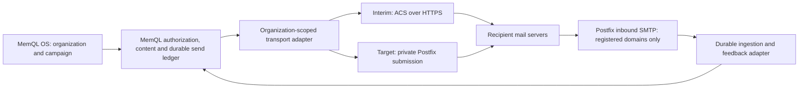

# Organization email transport — ACS bridge and early Postfix migration

**Decision recorded: October 1, 2026. Implementation plan, not a claim that
these capabilities have shipped.** The owner selected Azure Communication
Services Email (ACS) as an interim transport and self-hosted **Postfix** as
the intended replacement. MemQL remains the backend and product: it owns
organizations, authorization, domains, sender identities, contacts, campaigns,
automations, consent, suppression, reporting, and the user interface.

**Migrate sooner rather than later.** Start the Postfix work alongside the
ACS integration; begin a limited migration as soon as Azure confirms direct
SMTP eligibility and the operational acceptance gates below pass. Microsoft's
September 30, 2028 retirement date is an outside service deadline, not our
target date. Do not let convenient ACS onboarding become an indefinite
dependency. No replacement SaaS email vendor is selected.

This document records research, the owner's decisions, engineering proposals,
cost assumptions, and unresolved external dependencies. It does not authorize
cloud deployment, subscription conversion, paid support, or a spending
commitment. Application changes are developed and tested locally first;
production deployment requires the owner's explicit instruction. The owner
separately authorized merging this documentation into `main`.

## 1. Why there are two stages

ACS can deliver over HTTPS without the cluster opening direct SMTP
connections to recipient servers. Microsoft's retirement guide states that
new customers cannot enroll in the retiring services beginning October 23,
2026, and that ACS Email ends September 30, 2028. Existing eligible customers
can continue during the transition; its FAQ says onboarding additional Email
resources is currently possible but subject to change. Verify eligibility
while provisioning; do not promise new client subscriptions can enroll after
the cutoff. The inspected subscription had no Communication Services or
Email Services resources on October 1.
([Microsoft retirement guide](https://learn.microsoft.com/en-us/azure/communication-services/acs-retirement-and-breaking-changes-guide))

ACS is the outbound bridge. It does not give MemQL an incoming mailbox service.
For the interim, replies go to a real mailbox the client already uses. The
Postfix phase adds receipt into MemQL. A mailbox client protocol such as IMAP
is a separate product decision, not implied by accepting incoming SMTP.
([ACS overview](https://learn.microsoft.com/en-us/azure/communication-services/overview),
[Email overview](https://learn.microsoft.com/en-us/azure/communication-services/concepts/email/email-overview))

## 2. Research and selection

| Option | What it adds | Decision |
|---|---|---|
| Postfix | SMTP receiver, durable spool, queue manager, SMTP delivery and transport retries; optional LMTP/pipe handoff | Selected target. Keep its responsibility at the mail protocol and queue boundary. |
| KumoMTA | Open-source MTA aimed at high-volume outbound delivery | Revisit if measured throughput or provider-specific transport tuning outgrows Postfix. It is not required to begin. |
| Postal | Self-hosted delivery product with domains, organizations, UI, APIs, webhooks, and its own persistence | Not selected: duplicates product responsibilities that belong in MemQL and adds a MariaDB dependency. |
| Stalwart | Broad mailbox server with SMTP, IMAP/JMAP, and additional mail services | Not selected for the initial transport need. Reconsider only if full mailbox hosting becomes a requirement. |
| Microsoft Graph / Exchange Online | Mailbox-oriented Microsoft sending | Existing MemQL support remains useful for existing installations; it is not the selected campaigns architecture. |
| ACS Email | Managed outbound delivery using verified domains | Selected temporary bridge while Azure SMTP eligibility is resolved. |

Postfix is distributed under IBM Public License 1.0 or Eclipse Public License
2.0; KumoMTA uses Apache 2.0. There is no mandatory per-message software
license charge for operating the selected open-source transport. License
notices and distribution obligations still apply to packaged images.
([Postfix licensing announcement](https://www.postfix.org/announcements/postfix-3.3.0.html),
[KumoMTA repository](https://github.com/KumoCorp/kumomta))

KumoMTA's hardware guide starts at four CPU cores, 4 GB RAM and 20 GB storage;
its larger examples are workload-dependent, not the minimum bill for MemQL.
Postal recommends a dedicated host with two cores, 4 GB RAM and at least
25 GB storage, and requires MariaDB. Current Stalwart Community is AGPL-3.0;
its built-in tenant management is an Enterprise capability. None of those
products removes Azure's outbound port restriction.
([Kumo hardware](https://docs.kumomta.com/userguide/installation/hardware/),
[Postal prerequisites](https://docs.postalserver.io/getting-started/prerequisites/),
[Stalwart editions](https://www.stalw.art/compare/))

## 3. Azure feasibility: policy versus measured behavior

Microsoft documents direct outbound TCP 25 for VMs/VM scale sets under
standard Enterprise Agreement or Microsoft Customer Agreement for enterprise
(MCA-E). Other subscription types are blocked; qualified Enterprise Dev/Test
has a specific exemption process. A generic Microsoft Customer Agreement is
not sufficient evidence of MCA-E eligibility. Opening an NSG rule or adding
a NAT gateway does not override the subscription policy. Port 587 works for
authenticated submission but cannot replace port 25 when delivering directly
to arbitrary recipient MX servers.
([Microsoft SMTP policy](https://learn.microsoft.com/en-us/troubleshoot/azure/virtual-network/troubleshoot-outbound-smtp-connectivity))

### Live observations, October 1, 2026

These are measurements from the existing East US AKS installation, not a new
mail deployment. Account identifiers and contact details belong in the private
support case and are deliberately omitted from this public repository.

- Fresh subscription/billing reads reported an enabled subscription under
  `MicrosoftCustomerAgreement`, account type `Individual`, subtype `Other`,
  with quota ID `PayAsYouGo_2014-09-01`. These labels alone do not settle MCA-E
  eligibility.
- AKS uses Azure networking and a Standard load balancer for outbound access.
  The installation has two mesh nodes and one database node, all
  `Standard_D2as_v7`. This inventory does not prove spare capacity for mail.
- At **18:11:54 UTC**, an existing workbench pod resolved Gmail, Outlook.com,
  and Yahoo MX hostnames. A TCP connection to port 25 at each timed out after
  12 seconds: `gmail-smtp-in.l.google.com`,
  `outlook-com.olc.protection.outlook.com`, and `mta6.am0.yahoodns.net`.
- Controls succeeded: `www.microsoft.com:443` connected, and
  `smtp.office365.com:587` connected and returned an SMTP `220` greeting.
- There were no Kubernetes NetworkPolicy objects in the workload namespace.
  The managed node resource group's NSG had no custom outbound rules and
  retained `AllowInternetOutBound`; no route tables were listed in that group.
- The probe opened connections only. It sent no SMTP commands or email,
  installed nothing, created no workload, and changed no networking.

**Conclusion:** direct port 25 was unusable from the tested workload. The
results and configuration are consistent with an Azure subscription
restriction. They do not conclusively identify every network layer, establish
inbound reachability, or demonstrate recipient acceptance/inbox placement.
Microsoft must confirm the account-specific cause and eligibility.

The portal's offer-switch diagnostic reported that MCA subscriptions cannot
use self-service offer switching and directed the account to a support ticket.
The owner authorized a free subscription-management inquiry, with no account
conversion or purchase. It was submitted on October 1, 2026 at 18:26 UTC;
the portal confirmed an open case under Basic support, severity C, with email
contact. The case number is retained in the working conversation rather than
this public repository. The inquiry asks Microsoft to confirm:

1. Whether the present agreement already qualifies and what caused the probe
   failures, including the applicability to the existing AKS VM scale sets.
2. The least expensive qualifying MCA-E path, itemizing agreement fees,
   minimum/prepaid consumption, term commitments, mandatory support, and
   eligibility conditions. In particular, whether a zero-minimum,
   no-additional-fee transition is available to this account.
3. Whether the subscription ID, tenant, resources, pricing/benefits and service
   availability can be preserved, and any operational impact.
4. How to verify access after an approved change, including any required
   deallocation/restart or network changes. No restart is authorized by this
   research.

Do not conflate the general MCA's lack of a purchase minimum with a confirmed
MCA-E offer for this account. Do not buy an enterprise commitment or paid
technical support merely to ask a billing question. A support plan is not an
SMTP exemption. The commercial answer remains unresolved until Microsoft
provides terms.
([MCA purchasing information](https://www.microsoft.com/en-us/licensing/how-to-buy/microsoft-customer-agreement),
[Azure support FAQ](https://azure.microsoft.com/en-us/support/legal/faq/))

### Support response and follow-up (October 1, 2026)

The owner received a response from Azure Billing and Subscription Management.
That team classified subscription eligibility, SMTP enablement, and commercial
terms as outside its scope and referred the commercial questions to
[Azure Sales](https://azure.microsoft.com/en-us/contact/). This is a routing
response, not an eligibility determination, an SMTP exemption, or a price quote.
The account's eligibility and any minimum commitment remain unconfirmed.

Keep the follow-up in two parts. The drafts below are prepared for review;
they have not been sent to Sales or submitted as a new technical case:

- **Commercial / Azure Sales:** We want the lowest-cost way to operate our own
  outbound SMTP transport in Azure. Does our existing agreement qualify as
  MCA-E for the published TCP 25 policy? If not, please quote the least expensive
  eligible agreement for this account and itemize any upfront or recurring fee,
  minimum spend, term, mandatory support, and resource-migration requirement.
  Can our existing subscription and resources remain in place? We are requesting
  information only; this is not authorization to purchase or change an agreement.
- **Technical / existing case routing:** Please route the SMTP eligibility and
  connectivity portion to the appropriate Virtual Network or VM networking team,
  or identify the exact diagnostic/support category. From an existing AKS node's
  workload, DNS resolves Gmail, Outlook, and Yahoo MX hosts, but all three TCP 25
  connections time out; HTTPS 443 and authenticated SMTP 587 connect. Please
  confirm whether Azure applies a subscription-level SMTP block to this
  subscription and whether its current offer is eligible for exemption. The
  separately requested commercial quote is being directed to Sales.

Do not treat a support-plan purchase as an SMTP exemption. Technical cases may
require a paid support plan; investigate the existing free diagnostic and Sales
path first, and obtain the owner's approval before any purchase. The published
[SMTP policy](https://learn.microsoft.com/en-us/troubleshoot/azure/virtual-network/troubleshoot-outbound-smtp-connectivity)
continues to distinguish standard EA/MCA-E, qualified Enterprise Dev/Test, and
other offers. ACS remains the interim transport while this is unresolved.

## 4. Ownership and the user experience

Every newly created organization-owned object must name its organization:
deployables, groups, campaigns, audiences, templates, sending identities,
rules and email connections. Reuse the platform's organization/account model
and access enforcement; do not invent a separate mail tenant system.

An owner/developer may manage their own organization and client organizations.
The selected organization is explicit and visible. When several are available,
do not silently choose the operator's organization. Child records inherit a
validated parent organization; conflicting references are rejected on the
server. Changing a parent reference cannot move a record across organizations
without the platform's authorized reassignment path.

For a client's campaign, the campaign, audience, template, connection, domain
and sender must resolve within that client's permitted scope. A missing,
revoked, unverified or disabled client sender must stop sending. It must never
fall back to the operator's address or another client's credentials. Being an
operator permits management; it does not make cross-client sender fallback
correct. Keep client visibility, consent and audit records separate even when
clients share one Azure subscription or physical MTA.

### Guided interim connection

The intended owner/developer flow is:

1. Select the organization in MemQL.
2. Choose **Connect Microsoft Azure**, sign in, and grant the clearly stated
   permissions. Select the accessible tenant/subscription and resource group.
3. Select an existing eligible ACS setup or name the resources to create.
   Show the billable service and scope before provisioning.
4. Enter the client's sending domain. Show the exact DNS records Azure
   requires, with copy actions and verification status. If MemQL has delegated
   authority over the matching Azure DNS zone, offer the exact record changes
   for approval. Otherwise the domain's DNS administrator publishes them.
5. Choose the sender address and display name, and a reply address. Confirm
   provider verification and sender availability before marking it ready.
6. Send an explicitly requested test to an address selected by the user, then
   show provider acceptance and subsequent delivery feedback separately.

Ordinary use must not require environment variables, repository edits, secret
copying, or repeated Azure portal configuration. Sign-in cannot grant rights
the user lacks or prove DNS ownership automatically. Provisioning requires
appropriate ARM rights, and role assignment requires additional permission.
The app must explain those specific blockers at the relevant step.

There is also a real installation prerequisite: Microsoft sign-in requires a
legitimate Entra application registration and consent configuration. Prefer a
MemQL-owned application with documented installation setup and securely stored
configuration, or an installation-owned app created through an approved
bootstrap. Do not impersonate the Azure CLI's public client ID to avoid app
registration. Choose authorization code + PKCE or a supported device flow;
validate state/issuer/tenant and bind completion to the requesting MemQL user
and organization. Persist expiring flow state across replicas. OAuth callbacks
are externally dictated HTTP and require the repository's explicit exception
approval if an existing approved route cannot serve them.

An interactive Azure session is for management setup. Background sends must
survive the browser closing and the connecting person signing out. Prefer a
scoped workload identity/service principal for durable delivery, or an
encrypted resource credential with an explicit rotation/disconnection path.
Do not silently broaden a person's Azure consent or embed operator credentials
in the SPA. Provisioning should discover/reconcile existing owned resources
after retries and partial failures instead of creating duplicates.

### Campaigns interface

Use Deployables as the primary visual reference, then Fleet and Cluster:
shared navigation, restrained typography, compact lists, one clear primary
action, contextual secondary actions, and a details panel for editing.
Keep organization selection in the creation flow and the record's details.
Avoid a wall of setup instructions, duplicated status labels, and technical
environment-variable banners. Readiness should say what the person can do
next: connect email, verify a domain, choose a sender, finish an audience, or
review a campaign. Empty states should lead to the appropriate action.
Verify narrow layouts, keyboard interaction, loading/error states, and both
themes, using the shared live-collection and attention-marker contracts.

## 5. Sender addresses and domains

A sender is an identity, not automatically a mailbox. For example, a client
can send as `news@client.example` once the client controls that domain, the
transport permits that address, and MemQL has authorized it for that
organization. A display name such as “Client updates” does not confer domain
ownership. `no-reply` is optional, not a requirement; a monitored reply address
is normally more useful.

Keep these concepts distinct:

| Value | Purpose |
|---|---|
| Header From | The client identity the recipient sees; checked against verified organization domains. |
| Reply-To | Where a normal reply should go; an existing client mailbox during the ACS bridge, or a registered MemQL inbound address later. |
| SMTP envelope sender / return path | Transport destination for delivery failures; generated/correlated by the transport, not an arbitrary user header. |
| DKIM signing domain and selector | Prove authorization for the client's domain; keys are restricted and rotatable. |
| Tracking / unsubscribe origin | MemQL's reachable endpoint and signed reference; not proof that the client's domain is verified. |

For ACS, create an Email Communication resource, verify the custom domain and
link it to the Communication Services resource. Read the actual DNS and sender
requirements from Azure instead of copying a fixed example. Register sender
usernames where required by the service. Keep the resource IDs, domain,
verification state and connection scoped to the organization.
([ACS send prerequisites](https://learn.microsoft.com/en-us/azure/communication-services/quickstarts/email/send-email))

For Postfix, MemQL manages DNS ownership challenges, SPF, DKIM selectors, DMARC
alignment, sender authorization and domain lifecycle. Use a dedicated sending
subdomain when suitable. Never replace a client's existing MX records just to
send campaigns: doing so could divert their ordinary mailbox traffic. A
separate bounce/reply subdomain can route incoming mail to MemQL while normal
employee mail stays where it is. Explain that subdomain choice changes the
visible From address when that subdomain is used.

Each outbound IP needs a stable hostname, matching forward DNS and PTR, and a
consistent SMTP greeting. Azure-owned IP reverse DNS is configured on the
public IP resource, not by creating an arbitrary customer reverse zone.
Validate the actual egress IP from the running mail workload; a Kubernetes
Service's inbound public IP is not proof of its outbound identity.
([Azure SMTP PTR guidance](https://learn.microsoft.com/en-us/azure/virtual-network/create-ptr-for-smtp-service))

## 6. Responsibility and transport boundaries

This is the proposed architecture, not the present deployment diagram.

| Responsibility | Owner |
|---|---|
| Organization selection, permissions, contacts, content, scheduling, personalization, consent and unsubscribe scope | MemQL |
| Campaign admission, limits, warm-up policy, pause/cancel, user-facing delivery ledger and reporting | MemQL |
| DNS verification lifecycle, sender authorization, credential/key references, routing and configuration reconciliation | MemQL |
| SMTP dialogue, MX lookup, durable mail spool, connection management, transient delivery retries after acceptance | Postfix |
| Message parsing, durable incoming records, attachments, correlation, rule execution and organization routing | MemQL ingestion integration and DSL |
| DKIM signing/verification and inbound spam filtering | Restricted transport capability, using established libraries or a maintained signing/filter component; policy and key ownership remain in MemQL |
| OS patching, queue disks, IP reputation, DNS, backups and operational alerts | Installation operator, surfaced through MemQL |

Postfix already implements a queue manager and SMTP/LMTP delivery processes.
Do not rebuild its transport retry machinery in campaign workers.
([Postfix architecture](https://www.postfix.org/OVERVIEW.html))

The common adapter must take an explicit organization, authorized sending
identity, immutable message/attempt reference and content. It returns a
transport acceptance reference or a classified refusal. An ACS resource and
a Postfix queue ID are transport details on the same ledger, not two campaign
models. Do not claim that the existing `Send(...) error` seam alone provides
that durable outcome model; extend it and its consumers deliberately.

### Queue ownership and duplicate risk

MemQL owns the campaign outbox until a transport has durably accepted a
message. After Postfix accepts it, Postfix owns SMTP delivery retries. A
timeout after submission is an **unknown outcome**, not proof nothing was
sent. Persist attempt state before network I/O and reconcile uncertain
attempts before trying another transport. Stable Message-ID and correlation
IDs help diagnosis but do not make SMTP exactly-once. An ACS operation ID must
not be treated as an idempotency guarantee without testing the documented
provider behavior.

Record accepted, deferred, rejected/bounced and confirmed delivery separately.
Acceptance by ACS or Postfix does not prove inbox placement. Cancellation stops
future submissions; mail already accepted may still be delivered. A migration
or rollback must not resend an accepted queue through the other provider.

### Feedback and suppression

ACS delivery reports are exposed through Event Grid. Implement an authenticated
and validated ingestion path with replay deduplication, or an approved pull
destination. The existing generic inbound HMAC contract is not automatically
compatible with Event Grid validation/authentication. Never accept an
unauthenticated payload's organization or recipient as authority.
([ACS Email events](https://learn.microsoft.com/en-us/azure/event-grid/communication-services-email-events))

For Postfix, collect queue/delivery events and structured DSNs into the same
MemQL ledger. Correlate with a trusted attempt and signed/opaque bounce token;
a forged external header must not suppress another organization's recipient.
Handle duplicates and out-of-order reports. A delivered report must not erase
a later valid complaint or unsubscribe.

Unsubscribe and preference records need explicit organization/list scope.
The existing cluster-wide suppression behavior must be reviewed before
independent clients use the installation. A client's opt-out must be honored
for that client's campaigns without silently opting the person out of every
unrelated client. Global abuse protection and confirmed invalid-recipient
policy are separate, deliberately defined controls. Migrate legacy records
without losing previous opt-outs. Keep signing keys shared and durable across
nodes, retain old keys while valid links exist, and do not reuse encryption
master keys as unsubscribe signing secrets.

## 7. Receiving email without adopting another backend

Receiving means accepting SMTP for explicitly registered domains/addresses,
durably storing the original MIME and metadata, then routing it into MemQL
records and automations. It does not require a second contacts/campaigns UI.

Proposed receive path:

1. DNS MX for a dedicated receiving domain/subdomain points to the mail edge.
2. Postfix rejects unknown domains/recipients during SMTP and applies bounded
   connection/message limits. It must never act as an unauthenticated relay.
3. Accepted messages enter a persistent spool. A narrow local delivery bridge
   hands them to MemQL; acknowledge only after durable storage. During MemQL
   downtime the queue defers delivery rather than dropping messages.
4. The bridge calls the internal gRPC capability. If using Postfix's pipe or
   LMTP delivery boundary, keep that protocol adapter local to the transport;
   do not invent an internal HTTP API in place of gRPC.
5. MemQL stores raw MIME/attachments in its blob layer and organization-scoped
   metadata in its memory graph. Parse with size/depth limits, scan suspicious
   content, sanitize rendered HTML, and do not automatically fetch remote
   images or execute email instructions.
6. Correlate replies through registered recipients and trusted conversation
   identifiers, then run the organization's configured rules. The envelope
   recipient mapping is authoritative; an untrusted From header is not
   authorization to access another organization's data.

Full IMAP/JMAP mailbox hosting, mobile mailbox sync and a webmail product are
outside this initial transport migration. If required later, evaluate a mail
store/protocol service separately without transferring MemQL's organization
and business logic to it. DKIM/filter software selection also remains an
implementation decision: Postfix supports Milter, but does not itself provide
every signing and spam-classification capability.
([Postfix Milter interface](https://www.postfix.org/MILTER_README.html))

### Email app and local capture: build now, without a production mail server

The owner's follow-up on October 1 adds an **Email app in MemQL OS** to the
current implementation. This is an inbox interface backed by MemQL, initially
useful for local testing. Production Postfix provisioning remains deferred
because of cost and the unresolved Azure eligibility. Do not add an Outlook
integration; the eventual source of incoming domain mail is our own transport.

Introduce an explicit capture transport using the same email submission
contract. In a locally configured installation it stores outbound messages for
inspection in the Email app instead of attempting external delivery or printing
message bodies and sign-in links in logs. An ACS-configured installation uses
ACS. Select the transport through installation configuration, not engine code
that branches on an environment name. Failed real delivery must not silently
fall back to capture and be reported as sent.

Capture records show recipient, sender, subject, timestamp, plain text and a
safe HTML preview. Label them **Captured for testing** so they cannot be
mistaken for externally delivered mail. Preserve useful test links, block
scripts and automatic remote content, and bound retention and attachment size.
This app should support the same future organization mailbox model without
claiming that capture is receiving mail from the Internet.

Ownership must cover both campaign messages and identity/operational messages.
Do not make a cluster-wide bucket of password-reset, sign-in or invitation
links visible to every signed-in user. Resolve each captured recipient to an
authorized mailbox/user and organization; unresolved recipients require a
restricted operator test surface. Domain ownership and mailbox access must be
checked server-side before displaying a message. Administrative test access
must be explicit and auditable, not an accidental consequence of being able to
browse campaigns. Avoid exposing authentication tokens through broad live-data
broadcasts, search indexes, routine logs or telemetry.

The existing bootstrap-only email-validation exception remains limited to
bootstrap. Opening the Email app requires an authenticated session and does
not itself prove control of a real external address. Test capture must not
create a production authentication bypass. Cover identity mail capture,
campaign previews, organization isolation, retention, safe rendering and
cross-replica reads with local tests. Cloud Email app empty states should
honestly explain that receiving is not connected yet.

## 8. Deployment and operation on Azure

Use the existing k3d/AKS + ArgoCD installation model and shared Kubernetes
components. Postfix is an infrastructure workload with a persistent queue,
not a new MemQL node type or a separate SaaS backend. Local and cloud use the
same manifest shape; image, storage class, replicas, resource sizes, domains,
DNS/TLS source and egress values differ. Local end-to-end tests deliver to a
controlled SMTP receiver rather than public inboxes.

Start with one bounded queue-owning instance for the pilot if its availability
limits are acceptable. A restart must reattach its durable queue before
sending. Do not mount one spool read/write into two independent Postfix
instances. Later replicas each need their own durable spool, stable identity
and tested failure/recovery process. Two replicas do not automatically provide
replication of queued mail or zero message loss.

The cloud design needs an explicit stable egress path and PTR-capable public
IP. Assess a dedicated mail node pool/subnet or isolated egress configuration
against the existing load balancer before adding cost. AKS node replacement,
autoscaling and upgrades must not unexpectedly change the sending IP. Merely
adding an inbound load balancer to the mail Service is insufficient. A separate
VM remains an alternative to evaluate if AKS egress cannot meet these needs,
but is not an instruction to create a second deployment topology now.

Private submission accepts only the MemQL integration's authenticated identity
and authorized sender domains. Public port 25 accepts incoming mail only for
registered recipients. The relay policy must reject arbitrary sender/recipient
combinations, and network location alone must not grant every cluster pod
permission to relay. Outbound STARTTLS policy and certificate handling require
deliberate defaults; Internet SMTP does not guarantee TLS to every destination.
([Postfix TLS behavior](https://www.postfix.org/TLS_README.html))

Operational controls required before general use:

- Queue depth/oldest age, disk capacity, deferred deliveries, delivery latency,
  per-domain response codes and bounce/complaint rates; alert on stuck or
  growing queues and failed ingestion.
- Per-organization quotas and rate limits, per-destination pacing, warm-up and
  a circuit breaker. One abusive client must not consume the shared queue or
  damage every client's reputation unchecked. Separate transactional and bulk
  traffic budgets; consider separate IPs when measured need justifies cost.
- Durable credentials, DKIM selectors, DNS verification evidence, restricted
  configuration snapshots and audit trails. Rotate keys and retain selectors
  long enough for queued mail; revocation must reach every replica.
- Backups and restore drills for routing/configuration and application data;
  a defined spool recovery policy that avoids replaying already delivered
  messages. Bound log/MIME retention and redact credentials and message bodies
  from routine diagnostics.
- Patch/image lifecycle, tested rolling upgrades, queue draining, resource
  limits and a runbook for blocklists, provider deferrals and compromised
  sender credentials. An open port is not a deliverability guarantee.

## 9. Incremental Azure cost estimate

Planning estimates in USD, East US, pay-as-you-go Linux, **730 hours/month**,
researched October 1, 2026. These are incremental infrastructure estimates,
not a quote or a limit. They exclude tax, labor, paid support, discounts,
reserved/savings-plan commitments, subscription-conversion terms, high-volume
logging and significant bandwidth. Reprice the exact deployment before
provisioning. No minimum-spend agreement has been confirmed.

Rates observed from the Microsoft Retail Prices API:

| Meter / sizing assumption | Observed rate | Monthly arithmetic |
|---|---|---|
| Standard_D2as_v7 compute | $0.0908/hour | $66.28 |
| Standard_D4as_v7 compute | $0.182/hour | $132.86 |
| Standard SSD E4 LRS, 32 GB | $2.40/month | $2.40 |
| Standard SSD E6 LRS, 64 GB | $4.80/month | $4.80 |
| Standard SSD E10 LRS, 128 GB | $9.60/month | $9.60 |
| Standard SSD operations | $0.002 / 10,000 operations | Usage-dependent |
| Standard public IPv4 | $0.005/hour | $3.65 per IP |
| NAT gateway, if actually required | $0.045/hour + $0.045/GB processed | $32.85 fixed, plus traffic and IP |

Retail lookup is available without account credentials; match region,
`Consumption`, Linux product and exact SKU, exclude Spot/low-priority and
reservation rows, and follow pagination. The estimate used the standard
Internet egress allowance of 100 GB/month and then approximately $0.087/GB
for the first North America paid tier; the allowance may already be consumed
by the rest of the subscription. Recheck the current egress meter, zone,
routing preference and applicable agreement.
([Retail Prices API](https://learn.microsoft.com/en-us/rest/api/cost-management/retail-prices/azure-retail-prices),
[Bandwidth pricing](https://azure.microsoft.com/en-us/pricing/details/bandwidth/))

| Deployment scenario | Incremental planning range/month | Qualification |
|---|---|---|
| Small Postfix pilot on measured spare AKS capacity | $10–30 | Storage/IP/modest operations only; invalid if another node, new NAT/LB charges or substantial logging is needed. Shared capacity is not free capacity forever. |
| One additional two-core mail node | $80–110 | Approximately $66 compute + OS/queue disks + IP + modest overhead; excludes a new NAT gateway. |
| Four-core node for a KumoMTA evaluation | $150–190 | Approximately $133 compute plus storage/IP/overhead; larger queues or sustained throughput cost more. |
| Two independent two-core mail instances | $170–230 | Two compute instances, distinct queue storage/IPs and overhead; does not imply replicated spools. |

These ranges are engineering budgets based on the meter arithmetic, not vendor
recommended configurations. Disk throughput/IOPS and worst-case deferred queue
size matter as much as CPU. For sizing, start with daily message count ×
average encoded message size × tolerated outage days, then add queue/log
headroom. Attachments and MIME encoding raise both storage and transfer.
For example, 100,000 messages at 100 KB each represent roughly 10 GB of payload
before protocol overhead and retries. A million represent roughly 100 GB.
Charge each byte through every applicable meter; NAT processing and Internet
egress can both apply. Existing shared load balancer costs are not counted as
a new full load balancer bill, but additional rules/traffic may add cost.

ACS has a different, usage-metered cost model. Record its actual email and
data-volume meters during setup; compare the pilot's measured cost against
Postfix infrastructure and operating effort. “Open source” removes a transport
license charge, not Azure compute, disks, IP, DNS, monitoring or engineering.

## 10. Current code and changes still required

The current tree already contains campaigns, audiences/import, templates,
sender identities, scheduling, send workers, unsubscribe/tracking,
suppression, feedback and warm-up machinery. Do not rebuild these in Postal
or another application. Review and extend the existing seams:

| Area | Existing anchor | Required work |
|---|---|---|
| Delivery integration | `integrations/email/`, `app/adapters.go` | Add ACS adapter and explicit organization-scoped resolution; preserve existing Graph/SMTP consumers and refuse cross-client fallback. |
| Campaign send and identity | `component/campaigns/` | Carry organization and attempt references, represent uncertain/accepted outcomes, verify the chosen sender, reconcile provider feedback. |
| Ownership | `component/memql/organization_ownership.go`, OS organization helpers | Explicit organization on creation, consistent server checks, safe handling of existing rows and derived children. |
| UI | `clients/os/src/apps/campaigns/` | Guided connection and verification plus shared Deployables/Fleet layout patterns. |
| Email rules | `component/emailrules/` | Resolve current author authority correctly across nodes; fix the staff-authored organization rule defect tracked in #5679. |
| Inbound | `component/inbound/` | Authenticated provider feedback now; durable SMTP/MIME handoff and receiving-domain authorization in the Postfix phase. |
| Secrets/configuration | Existing secret encryption and persisted configuration | Store restricted connection material, share flow/key state across nodes, support rotation/revocation without manual environment edits. |
| Installation | `deploy/k8s/` and existing ArgoCD path | Add transport manifests later, persistent spools, stable egress, observable reconciliation and approved cloud rollout. |

Adding required fields to stored concepts can make old rows unwritable.
Inventory and migrate existing ownership/suppression/configuration rows before
tightening schemas. Scope repair migrations by concept and preserve historical
campaign attribution. New organization references must also be enforced at
execution time, after scheduling and after any permission revocation.

Related repository work:

- [Campaigns program #4819](https://github.com/znasllc-io/memql/issues/4819)
  and its completed tasks are the starting point, not proof ACS onboarding
  already exists.
- [Organization-authored email rule #5679](https://github.com/znasllc-io/memql/issues/5679)
  is a concrete defect to repair and regression-test during implementation.
- [Notification channels #5504](https://github.com/znasllc-io/memql/issues/5504)
  and [pipelines #5480](https://github.com/znasllc-io/memql/issues/5480) overlap
  with the reusable email sender. Coordinate the seam; do not close those
  broader issues merely because this plan or the Campaigns adapter lands.

## 11. Implementation order and acceptance gates

### Stage A — usable ACS bridge locally

- [ ] Confirm enrollment and register the legitimate Azure sign-in application.
- [ ] Implement explicit organization ownership and isolation throughout the
  requested creation paths; preserve valid existing data.
- [ ] Implement sign-in, resource discovery/provisioning, custom-domain
  verification, sender selection, secure durable credentials and disconnect.
- [ ] Route campaign and authorized rule sends through the correct client's
  connection. Preserve client From/Reply-To and unsubscribe behavior.
- [ ] Implement honest acceptance/feedback status and persistent shared
  unsubscribe configuration; review tenant-scoped suppression.
- [ ] Polish Campaigns using the shared UI, with action-oriented readiness.
- [ ] Add the Email app and explicit local capture transport, including
  recipient/organization access checks and safe previews; no Outlook
  integration or production Postfix deployment in this stage.
- [ ] Run local k3d/ArgoCD tests, including two replicas and a request completed
  on a different node from the one that began it. Test expired consent,
  revoked rights, cross-organization IDs, partial provisioning, malformed
  feedback, throttling and restart/reconnect behavior.
- [ ] Let the owner test locally. No production deploy is implied by a PR or
  documentation merge.

### Stage B — unblock and prove Postfix

- [ ] Obtain Microsoft's written eligibility/commercial answer. Review any
  proposed subscription change with the owner before accepting terms.
- [ ] Verify port 25 from the intended egress path after approved changes;
  test incoming TCP 25 separately if receipt will be enabled.
- [ ] Build local Postfix submission/receipt, durable spool and feedback
  adapters behind the same organization-scoped delivery contract.
- [ ] Demonstrate no open relay, no unauthorized sender, correct DKIM/SPF/DMARC
  and PTR, queue recovery, bounded ingestion, secure attachments, and no
  cross-organization disclosure.
- [ ] Establish measured resource sizing, operating runbooks and the exact
  incremental Azure budget. Get explicit production rollout approval.

### Stage C — migrate early, organization by organization

1. Validate a pilot organization and seed recipient accounts. Inspect received
   headers, alignment and provider feedback with the owner's approved tests.
2. Warm the new IP/domain gradually. Sending-domain reputation may carry over
   imperfectly; ACS's IP reputation does not transfer to a new Azure IP.
3. Pause new submissions for the selected scope, record the routing version,
   and let accepted ACS attempts finish/reconcile. Route only new attempts to
   Postfix. Keep campaign IDs, contacts, consent and statistics in MemQL.
4. Keep ACS selectors/records and feedback alive while old accepted messages
   and reports can still arrive. Add the Postfix DNS records without
   accidentally removing unrelated SPF authorization or client MX records.
5. Monitor delivery, deferrals, complaints, queues and replies, then expand.
   Rollback changes new submissions only; never duplicate accepted messages.
6. Once every organization is migrated and retention/reconciliation gates are
   satisfied, revoke ACS credentials, remove unused resources and obsolete
   code/configuration, and update the durable public operating guide.

Set the actual pilot/cutover dates after Microsoft's answer and local test
results. Track those milestones in GitHub with an owner and due date rather
than treating the 2028 retirement as permission to defer the work. This plan
is complete only when the self-hosted path has replaced ACS, not when ACS
first sends an email. Delete the spent planning document when that work ships,
preserving the decision rationale in an internal design record and the
supported behavior in the public reference.
