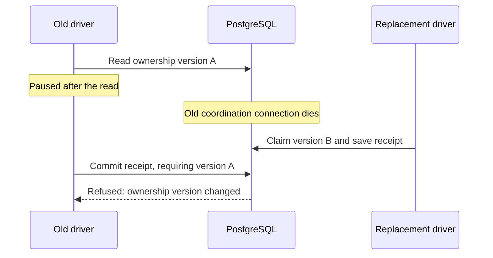

# MemQL self-hosted delivery

This plan supersedes conflicting implementation choices in the October 4
delivery plan. The owner authorized implementation and local testing on
October 5, 2026. Public publication and production deployment require a later
approval of the exact candidate. Do not retire working CI before parity is
measured. The October 6 direction below replaces the Cockpit-first execution
strategy. Additional Azure capacity and production networking changes remain
unapproved; the cost research is a proposal, not provisioning authority.

## Boundaries

### Workbench execution and local parity (owner clarification, October 6)

Portable CI and image builds belong on the cluster's Workbench-managed
Kubernetes Jobs, both locally and in Azure. MemQL owns the pipeline, versioning,
approval and release decisions. Use the same DSL definitions, execution and
artifact contracts, authorization, GitOps reconciliation, health checks and
cleanup in both installations. Architecture, registry endpoints, storage
classes, placement and resource sizes are configuration values. The local
installation must actually build and update itself, not merely simulate a
deployment receipt. Local success does not establish production success.

Local execution is an on-demand development and release-rehearsal capability.
Azure provides the independently available shared CI and production release
capacity. Declare trigger and publication ownership so connecting both
installations does not duplicate every run or allow competing publishers.
Neither execution path may silently fall back to another host or architecture.

Start local execution with one substantial job at a time. Exercise at least
two serving Kubernetes nodes and a dedicated build node for cross-node
placement, recovery and rollout tests. All local nodes share one Docker VM:
their aggregate reservations must fit its actual CPU, memory and disk, rather
than each node treating that shared capacity as independently available.
Measure duration, memory, disk/cache growth and interference with serving
workloads before increasing concurrency. Preserve the existing local database
and installation when changing its topology or networking.

Rehearse Cilium with compatible, pinned K3s/Cilium versions locally before
proposing the production migration. Prove allowed access and denied access;
the presence of a NetworkPolicy is not proof of enforcement. Local ARM64
builds prove that platform's artifacts; the Azure release requires native
amd64 evidence. Real Azure identity, registry/storage permissions, node
autoscaling and node/disk deletion remain cloud checks. A laptop's virtual
nodes cannot prove independent physical-host availability.

Cockpit remains an optional execution capability for explicitly declared native
host requirements, including macOS packaging/signing. Retain its pipeline-step
consent, exact-commit checkout, native execution, output/artifact contracts,
capacity and cleanup. Keep general worker cancellation, policy and child-process
fixes and Mac build-script cleanup regardless of routing. Move normal portable
CI off Cockpit before evaluating whether its container-services/cache backend
still needs to be supported; do not remove shared native-runner safety code.
Prove ordinary cluster builds with Cockpit disconnected. Enabling a native
step still requires both pipeline permission and the machine owner's consent.

The proposed Azure starting point is one dedicated, tainted Linux amd64 user
pool, scaling between zero and one build node, with bounded concurrency and
cache/artifact retention. A production proposal must include current regional
costs, quota/availability, existing-node headroom, migration impact and recovery.
Use deletion of idle nodes and temporary disks rather than assuming a stopped
VM has no storage cost. Basic network-policy enforcement does not require the
optional paid Advanced Container Networking Services bundle. The existing
single database replica makes node reimaging a maintenance decision.
Issue #5844 retains the earlier two-week Cockpit evaluation; reconcile that
record when the subsequent capacity/networking plan is approved, and preserve
the independent CI/release observation gates in #5506 through #5509.

### Local Cilium and certificate regression evidence (October 6)

A disposable two-node K3s v1.35.7+k3s1 cluster with Cilium 1.20.2 revealed that
Cilium excludes Job completion-index labels from endpoint identities. The probe
now starts behind a scheduling gate, assigns a verified role with UID/version
guards, and releases its own gate in the same patch. Increasing a sleep had
remained unreliable; it is not the implementation. The live proof retains its
three positive and negative rounds and refuses inconclusive results.

The same rehearsal found that a pod-only proof does not validate Cilium CIDR
exclusions. Workbench now audits all additive NetworkPolicy IP grants, including
before using a cached pod proof, and refuses missing protected ranges or an
absent namespace-wide egress policy. The audit does not replace live enforcement
or provider-specific endpoint tests. Final targeted local runs passed the shipped
policy, missing egress, missing IP exclusions and missing listener cases on both
K3s's policy engine and Cilium. Race and overlay gates passed. These are local
Runner tests with disposable resources, not the installed Workbench release cycle.

The database-required full workspace run exposed macOS LibreSSL certificate
failures in both installer and k3d checks. PR #5867 shares a portable SAN parser
and exact DNS matching; full installer/k3d suites and affected OpenSSL 3 cases
pass. The full combined workspace run remains outstanding after integration.

### Complete CI ownership and coverage parity (owner clarification, October 6)

The final delivery path must have **no GitHub Actions dependency**. MemQL owns
triggers, selection, checks, build execution, evidence, approvals, publication,
updates, recovery and retention. Preserve useful free GitHub repository services
such as dependency alerts, secret scanning and push protection where the
repository is eligible. CodeQL's default setup still runs Actions: use analysis
under MemQL with SARIF upload instead, subject to the repository's license and
feature eligibility. Do not silently enable paid security products for private
repositories. Keep working Actions lanes until their replacements have real
coverage and the existing retirement gates are satisfied.

The October 6 inventory found these gaps; definitions are not execution proof:

| Coverage | MemQL definition / remaining work |
| --- | --- |
| Engine build/vet, environment and DSL validation, generated contracts | Core checks, five tagged build/vet variants and both cluster-E2E compilation variants are declared in the package (PR #5869). Installed Workbench execution remains to be proved. |
| Unit and database suites | Four ordinary shards, five database shards and all seven node-tag test variants are declared. Database-required execution must fail on a missing database. |
| Fuzz, conformance, differential, proving | Definitions exist; reproduce triggers, pinned tool versions, seeds and artifacts. Microbenchmarks are not capacity tests. |
| Module and shell boundaries | Standalone module build/vet/tidy and Bash 3.2 lanes are declared. Local tool runs covered all 53 tracked modules and the capability scripts. |
| OS, SDK, Viewkit and editors | Initial OS/TypeScript definitions exist; port OS Docker-stage validation and VS Code/productivity extension packaging and Linux/macOS desktop/web host matrices. Native work remains explicit and consented. |
| Secrets and vulnerabilities | Gitleaks, workspace govulncheck and all-lockfile npm audits are declared and passed local tool runs. Standalone three-language CodeQL and complete Go/npm SBOM lanes are being added. SARIF publication, Scorecard and periodic scheduling remain open. |
| Code Quality | The enabled GitHub product uses Actions and has license/AI-credit charges. Inventory and replace its deterministic Go, JavaScript/TypeScript and Python rules. Its AI findings are enabled on push; proprietary AI findings/autofixes are not replaced by the CodeQL security suite. Do not describe that suite as complete Code Quality parity. |
| Additional delivery security | Add dependency/container vulnerability checks and verified provenance/signatures with explicit blocking policy. These extend coverage; they were not existing dedicated workflow lanes. |
| Build and release | Replace seven engine-image builds, database/toolchain images, fixture mirrors, SDK/editor/docs publication and the legacy tag-triggered release cascade. |
| Companion repositories | Port Cockpit, project-template and instance checks and release paths independently; their current package declarations do not provide equivalent CI. |
| GitHub integration | Preserve exact-SHA status reporting, PR/merge-group/manual/push/scheduled semantics, cancellations and failure evidence; change required checks only after equivalent checks actually report. |

For each legacy lane record its inputs, triggers, platforms, tools, expected
failure behavior, retained reports, new owner and actual replacement run. No
unchecked item may become green merely because its job is missing or skipped.
A disabled future suite is reported as **planned**, never passed.

Future suite placeholders, intentionally outside this delivery implementation:

- **Load/capacity:** versioned workloads, concurrent users/request rates, warmup
  and measurement windows, latency percentiles, errors and sustainable throughput.
- **Stress/soak and resilience:** saturation, long-running resource growth,
  recovery after dependency/node disruption and explicit abort limits.
- **Resource and cost baselines:** CPU/memory/storage/network per workload and
  per active user, with recorded hardware, pricing date and estimation bounds.

These will consume the same pinned-candidate execution and artifact contracts.
They have no fabricated baselines or pass thresholds and are not required checks
until implemented and calibrated. Keep their activation explicit.

### Security report ingestion primitive

The GitHub App client now has bounded SARIF upload and processing-status
primitives. They submit exact report bytes with a pinned commit/ref, return a
content digest and accepted upload id, and distinguish pending, complete and
failed ingestion. Redirects are refused. Ambiguous POST responses never trigger
an automatic second upload. Framing and size checks do not substitute for
successful scanner execution or artifact/source verification.

The adapter is tested against an in-process GitHub fixture, including real
standalone CodeQL report bytes. It is not yet a live GitHub upload or a wired
pipeline publication stage. The caller must journal upload intent/receipt,
bind the report to its execution evidence, reconcile uncertain submission,
and retain/report ingestion failures. The GitHub App's code-scanning alerts
permission must be explicitly configured; this change grants no permission and
puts no upload credential into a build Job. See GitHub's
[external CI guide](https://docs.github.com/en/code-security/how-tos/find-and-fix-code-vulnerabilities/integrate-with-existing-tools/use-with-existing-ci-system)
and [SARIF API](https://docs.github.com/en/rest/code-scanning/code-scanning#upload-an-analysis-as-sarif-data).

### Large artifact storage primitive

`azureblob.CreateVerifiedStream` stages bounded chunks, checks the complete
source's declared size and SHA-256, and commits with a create-only condition.
Adoption reads and hashes the stored bytes under an ETag condition; a lost
commit response is never a successful upload on its own. Different concurrent
attempts use distinct block ids. Receipts retain the verified ETag, digest and
size and strip signed URL credentials. This does not enable a storage-account
immutability policy: later consumers still verify the pinned content.

Local Azurite tests cover a 128 MiB stream, reconciliation by a replacement
caller, overwrite refusal, an empty stream and the real rootless-builder OCI
archive. The Workbench transport still uses its existing small-artifact path;
builder-to-store streaming, durable artifact ownership, retention and release
publication remain to be wired. Uncommitted blocks have provider-managed
expiration, and committed objects need explicit ownership-guarded cleanup.

`DeleteVerifiedStream` verifies the receipt's size, digest and exact ETag before
an ETag-conditional delete, then confirms absence. A stale receipt cannot delete
a replacement version; a lost reply is reconciled by a read. Its caller must
prove ownership and retire producers before requesting cleanup. Unit tests cover
replacement during deletion and uncertain responses; real Azurite proves stale
receipt refusal, confirmed removal and replacement-caller reconciliation.

`ClusterAPI.ReadPodFile` now provides a bounded file read over Kubernetes'
[versioned exec protocol](https://github.com/kubernetes/apimachinery/blob/v0.32.0/pkg/util/remotecommand/constants.go).
It executes `cat` with a literal path argument, with no shell, stdin or terminal,
uses the cluster CA and current projected identity, refuses redirects and
requires both a successful remote exit and normal connection closure. The
operation is capped at 2 GiB and 30 minutes; partial output is never success.
Callers still need to authorize and check the Job/pod identity around the read:
the exec API has no UID precondition.

`SnapshotArtifacts` accepts a complete uncompressed archive into private scratch
files, computes each file's byte digest, and refuses unsafe or duplicate paths,
links, undeclared or missing files, truncated transfers and trailing payloads.
All temporary files are removed on refusal or explicit close. A real local K3s
fixture proved a 128 MiB file through the authenticated stream, snapshot,
create-only Azurite upload and independent readback/reconciliation. It also
proved oversize and missing-file refusal; the fixture deletes its namespace,
blob container and local snapshots. Credentials never entered the fixture pod.

These primitives are not yet the installed runner's artifact path. The collector
container contract, narrowly scoped `pods/exec` grant, caller identity checks,
durable intake intent/receipt, quota/retention and final release wiring must land
together before large artifacts can qualify a pipeline run. The live fixture's
namespace-scoped loopback proxy is a test harness, not a product connection path.

### Cluster update requirements (owner clarification, October 6)

Owners and developers must discover and trigger installation updates from
**Cluster > Updates** in MemQL OS. Local and cloud installations use the same
workflow, authorization and GitOps reconciliation contract; provider-specific
values describe placement, never a second user workflow. Show installed and
available versions independently for engine, Cockpit and editor extensions.
Unchanged components retain their versions. A coordinated release record binds
the selected commits, compatible versions, verified artifact digests and tests.

The review names the exact target and candidate, disruption assessment and
rollback point. The final action starts a durable operation outside the pods
being replaced. Its states include preparing, deploying, verifying, cleaning up,
complete, failed and recovery required; a lost connection is not completion.
Runtime update attention uses the shared OS attention service and remains
distinct from feature-discovery attention. The owner-only public-release gate
is separate from the owner/developer installation-update permission.

Existing rolling replacements are a starting point, not proof of uninterrupted
use. Measure website requests, authenticated requests, active streams and
subscriptions throughout real local and production rolls. New replicas must be
ready before taking traffic; old replicas drain. Verify mixed-version operation
and database migration compatibility before a rolling update is offered. A
single-replica database restart needs an explicit maintenance assessment. This
plan does not authorize adding Azure resources or changing production
networking; local preparation and verification precede that approval.

Cleanup is part of every attempt, including cancellation, failure, worker loss,
controller replacement and interrupted rollback. Persist each temporary resource's
ownership and identity before creating it; reconcile uncertain deletion against
the correct target before releasing capacity. Cleanup has durable progress and
bounded retry, and unfinished cleanup prevents a completed deployment verdict.
Never infer ownership from age alone. Preserve the active installation, client
assets, persistent volumes, secrets and a defined rollback artifact set. Verify
temporary pods/Jobs/Secrets, containers, networks, anonymous volumes, build
workspaces, caches/builders and any explicitly created cloud resources against a
before/after inventory. Do not delete shared or unrecognized Azure resources.

The existing deploy-control `Deploy` RPC only transitions a record and rejects
`docker-local`; it cannot serve as the update button's effect. The current
deployment DSL also contains retained historical orchestration. Complete the
runner and GitOps path before exposing a deploy action; do not report an async
record write as a successful update.

### Existing implementation boundaries

- Ship the default CI/CD workflow as sealed core DSL. Clients configure it,
  call its public constructs, or compose separately named workflows. The
  template must not copy the core workflow into each client repository.
- The event-to-mode decision and event/mode applicability of manifest stages
  now run through sealed core pipeline automations. The compiler requires the
  explicit selected stage set, and the selector definition is part of the
  recovery fingerprint. Package and changed-path selection still has policy
  in Go and remains open work.
- Keep orchestration decisions in DSL; integrations provide bounded effects.
  Change the runtime only for missing general primitives or correctness.
  Audit queries, mutations, specifications, logic and automations while
  implementing the workflow. Record each missing primitive with a non-CI
  use case and an independent regression test. Do not put CI policy in Go
  merely because the present DSL cannot express it.
- Keep independent component versions in one coordinated release record.
  Approval binds commits, artifact digests, evidence and targets; changed
  inputs invalidate it. One approval covers public publication and deployment.
- Keep client values in the instance repository. The template supplies generic
  consumption conventions and upgrade tests.
- Use Workbench-managed cluster Jobs for normal portable builds, with an
  explicit container contract. Native host requirements may use opted-in
  Cockpit machines. Preserve repository consent and reserve capacity across
  replicas and across the clusters a worker serves. Queue bounded work when
  suitable capacity is busy. Never infer Docker health from an old label.

## Implementation sequence

- [x] Recover the delivery branch against current main; preserve both histories.
- [x] Resolve merge conflicts and pass compiler, driver, outbound and verifier
  baseline suites (database-backed cases still require separate verification).
- [x] Protect server-authored run/configuration records through a general DSL
  contract; verify direct writes cannot forge evidence (#5822).
- [ ] Restrict inbound/outbound row visibility and verify every legitimate
  reader, writer and subscription (#5802, #5804).
- [ ] Complete runner readiness, egress isolation proof, service-account
  isolation, capacity and recovery cases (#5803, #5810, #5811, #5812, #5821,
  #5823; check newer issue state before implementation).
- [ ] Finish channel management, false-green evidence and rollout verification
  in the existing OS surfaces (#5504, #5505, #5506).
- [ ] Finish the default workflow policy boundary in public core DSL:
  - [x] Event-to-mode and event/mode-to-stage selection are DSL decisions;
    compilation requires an explicit selected stage set.
  - [x] A separately named workflow composes the sealed default and proves the
    default remains reusable.
  - [ ] Move remaining package and changed-path selection policy behind DSL
    decisions and keep the manifest as configuration.
- [ ] Add candidate preparation, compatible component versions, owner approval,
  artifact provenance and idempotent release/deployment receipts.
- [ ] Reproduce all necessary build/test/security/docs/release lanes for engine,
  Cockpit, SDK, editors, template and instance; classify obsolete lanes with
  evidence before removing them.
- [ ] Update template and instance consumption/configuration, docs and diagrams;
  reconcile already-resolved issues with merged evidence.
- [ ] Test real local cluster execution, multi-replica ownership and recovery,
  Cockpit native execution, candidate approval and local rollout. Verify the
  portable cycle with Cockpit disconnected; retain regression coverage for any
  still-supported Cockpit container execution.
- [ ] Review the rendered OS in Chrome with desktop/narrow and light/dark
  states. Label fixtures and simulated external services explicitly.
- [ ] Present a working local demonstration and remaining production-only
  checks. Preserve all production gates pending owner review.

## Failure and resource cases

Exercise duplicate/reordered events, cancelled and superseded runs, lost
worker/agent/workbench connections, lease expiry with a surviving old process,
restart during publication, expired credentials, unavailable images, exhausted
disk/CPU/memory, stale hardware reports, occupied capacity, revoked consent,
partial artifact upload, failed health verification and failed rollback.
Confirmed effects are adopted from durable receipts; uncertain publication is
reconciled against the destination before retry. No absence of evidence means
success. Build capacity must leave room for the serving installation.

Recovery is a per-step contract. Reconcile a disconnected worker before
reassigning its work; fence expired attempts so a returning laptop cannot
publish results for its replacement. Use bounded retry budgets and persist
the reason a run stops. Retain completed steps only when their pinned inputs
and durable artifacts still match. A compiler normally restarts; checkpointed
tasks or uploads may resume when their capability supports it. Offer a safe
user resume after exhausted retries without silently repeating uncertain
side effects. Nexus redesign is outside this work.

## Evidence boundaries

Workbench queued recovery uses a durable pre-create record on the attempt's
Secret. The record binds the execution definition and credential names, never
credential values. Before every Job create, a runner claims it with a unique
nonce and Kubernetes UID/resource-version preconditions. Only an explicit quota
or throttle rejection returns it to queued. A new runner may resume queued work;
an absent Job after an ambiguous create remains uncertain and is never reposted.
Lost metadata replies are reconciled by reading their recorded state. The V3
step action rejects older runners during mixed-version updates; attempts without
this record retain conservative recovery. This does not resolve every late
cancel-versus-create race or prove installed end-to-end recovery by itself.

Local integration tests may replace GitHub delivery and public publication
endpoints with explicit fixtures, while exercising the real engine, database,
worker and isolated local rollout. They do not prove cloud identity federation,
registry/marketplace permission, native signing, public webhook reachability,
cloud storage behavior or production recovery. Those remain named rehearsal
steps. Time-window milestones #5506–#5509 stay open until observed.

## Generic recovery gaps found during dogfooding

Independent build shards exposed a general language gap: `for` only executed
sequentially, and `parallel` required a statically written branch per item.
`for item in items parallel(16)` now supplies bounded dynamic iteration to
logic and automations. The same form serves document batches and ingestion
tasks. It uses at most the declared number of workers, isolates item scopes,
preserves source indices in execution keys, and joins active children before
the parent finishes. The bound is per loop; cluster and machine capacity
remain the runner's responsibility. Returns inside a parallel iteration are
refused. Ordinary continued errors, fatal journal errors, human waits and
cancellation have separate tests. Nested sequences now honor cancellation
before beginning another statement. This adds no CI-specific construct and
does not yet provide nested recovery or automation ownership fencing.

Recovery now classifies the registered operation and nested logic, loop and
parallel bodies. Known reads and computations may repeat; unknown callees,
external effects and sub-automations require explicit authorization. Query
classification follows registered calls and specifications, refusing unknown
IR, model predicates and unclassified forms. This applies equally to email,
file processing and delivery. Run-private calls remain conservatively refused
by automatic recovery until their scoped registry is included in the proof.

The work dispatcher no longer sets `AllowSideEffects` for automatic recovery.
Its previous justification used `runId:step:attempt`, but resume increments the
attempt, so that key cannot suppress a prior attempt's duplicate effect.
`resume_effect_uncertain` records this refusal; `resume_result_missing` records
a completed producer whose value cannot be recovered. Explicit user-requested
reruns retain their separate authorization path.

Completed unbound effects and skipped decisions are preserved. A saved nil
has an explicit receipt marker, distinct from an omitted result. Missing bound
values from completed effects refuse before reopening the journal; oversized
query results may be reread under replay admission without replacing the
original receipt. They read current state, not a snapshot. Tests cover nested
writes disguised as query calls, unknown executors, preserved prefix effects,
missing values and a nil receipt surviving JSON. The real-database automation
suite passed, including recovery on a separate executor after receipt failure.

The full database-required sweep exposed a second incomplete-read boundary:
Shopify's connector used its UI query, sorted by domain and capped at 100,
as a complete directory. A later store became an unknown webhook source.
Payload-sorted full pages also reported `hasMore: false` despite not proving
exhaustion. The engine now signals a possibly incomplete full page even when
that ordering has no continuation cursor, so the shared page walker refuses
it. The connector uses a separate sealed query in cursor order at one fixed
snapshot and publishes its cache only after traversal succeeds. Its local
cache now honors explicit fresh-read contexts. This is a query-contract fix,
not CI policy. The real uninstall/reinstall and two-engine inbound tests
exercise the consumer boundary; the engine test checks an untraversable full
page against a genuinely exhausted short page.

The Go-driven journal checks all initial writes: goal, run, first heartbeat
and step order, each pending step, and goal activation. Failure at each boundary
refuses admission before a heartbeat loop or command starts.

Still open: the automation executor needs ownership fencing as well as its
required journal and replay admission. The pipeline driver's new fencing is
described below; it does not automatically protect other execution paths.
Destination reconciliation must establish whether an uncertain publication
landed before it can safely repeat. Definition fingerprints still need
engine/bundle pins for transitive callees. No production release may rely on
automatic effect replay until these boundaries are demonstrated.

Self-upgrade must also cross a controller replacement. Persist the approved
candidate and deployment intent before changing the serving engine. ArgoCD
applies the pinned desired state independently; short reconciliation runs on
the replacement observe the same candidate, health evidence and publication
receipts. Do not weaken execution-definition checks to resume an old workflow
under a different engine binary. The first pipeline-capable engine still
requires a controlled bootstrap through the existing delivery path. This
handoff, health failure and rollback remain required end-to-end tests.

## Transactional ownership progress

Each pipeline claim now mints an opaque token, including a restarted process
with the same pod name. A per-run `workjournal.WithWriteGuard` protects initial
writes, queued steps, intents, receipts, bindings, terminal writes and background
heartbeats without changing the shared journal. An unreadable lease refuses
external-call admission. Ending a drive also ends its journal heartbeat.

A separate advisory-lock connection was insufficient: losing that session
releases its lock while the process can survive. The generic engine primitive
`ContextWithRowVersionFence` now compares the observed row version and commits
the protected mutation in one database transaction. It also checks the target's
read-merge version and stamps its replacement after the observed timestamp,
including under clock skew. Fenced critical sections have client and database
time limits; killing the writer connection rolls back the receipt. Claims,
updates and re-staging participate; adapters
must preserve an existing witness instead of refreshing a stale decision.
The context restricts writes and grants no authority. No CI policy is part of
this primitive; non-CI tests use edits and results derived from to-do rows.

Real PostgreSQL tests terminate the old driver's lock backend, let an independent
driver claim and save a result, and prove the returning writer cannot overwrite
it. Separate cases exercise same-node replacement, concurrent decisions, stale
source data, unchanged authorization and clock skew. These are in-process
engine/driver tests over real database connections, not a live two-pod rollout.

All writers of an ownership row must use this protocol. Old engine processes
must be drained before enabling it; a mixed-version fleet of unfenced writers
is not covered. External requests already in flight still need destination
reconciliation. Kubernetes result acknowledgment and the automation executor's
own journal remain separate boundaries to complete.

## Bounded outbound scan progress

The outbound worker advances one page per status per poll and restarts at
exhaustion. Other media, future retries and rows owned by another worker no
longer permanently hide later deliveries. Tests cover independent pending and
retry cursors and leave skipped rows unchanged. The real-row notification
fixture now follows the same pagination and reaches its own rows in a populated
test database. The full baseline exposed these gaps; its remaining corrections
also preserve protected-field tests under operator authority and explain the
cross-owner receipt read's `@serverOnly` contract.

## Child resource-limit isolation progress

Cockpit shell calls now apply limits inside the command's child, preserving
worker limits and those inherited by later pipeline builds. A refused limit
stops before the command. Child start errors no longer produce exit-zero
results, and cancellation kills the process group. macOS race tests and real
Linux/ARM64 execution in an existing local container image verify unchanged
worker limits, a subsequent real pipeline clone/command, policy loosening,
limit refusal and cancellation; Linux also verifies address-space limits.
The container had no network. No installed worker has been upgraded (#484).

## Fleet repository routing progress

Capability descriptors now carry generic, action-specific repository scopes.
Pipeline selection uses them before dispatch; an older or malformed scope is
unknown consent. Cockpit advertises its live allow flag and repository list as
one policy snapshot and re-registers when either changes. The command retains
its independent live-policy check. Cross-replica tests cover skipping a narrow
machine for an eligible one, refusal before dispatch when none accepts the
repository, and missing advertisements. This requires a coordinated Cockpit
upgrade; no existing machine policy has been changed.

## Queued routing progress

The generic workbench router now reports the actual selected replica before
sending a long-running request. Pipeline status prefers that route, with the
existing healthy-peer fallback. This avoids treating another replica's absent
local queue as lost work. An in-process hop through real forwarded handlers
and two real runners verifies one forward for a healthy queue, recovery after
restart or peer loss, and one eventual Kubernetes Job. The API server is a
fixture in these cases; this is not a live two-pod claim. Partitions can still
leave an old request alive, requiring the existing shared-Job deduplication.

## Queued Secret retention progress

Jobs and Secrets now carry the agent's absolute run deadline. Orphan cleanup
uses that deadline plus the outcome TTL, so a shorter workbench ceiling cannot
remove credentials while a step is still queued. Tests cover different agent
and workbench limits, the exact expiry boundary, and bounded cleanup of old or
malformed metadata (#5823).

## Workbench identity progress

The workbench now has `memql-engine-workbench`; only that subject receives the
pipeline Job/Secret Role. Existing custom-domain and package-roll operations
retain explicit grants. Overlay and federation-shape tests pass. A disposable
local namespace test asked the real API server about Job creation and Secret
reads: workbench allowed, shared engine/identity/step accounts denied. Cloud
activation still requires vendor trust preflight. OpenAI's current one-mapping
rule requires an exact two-subject CEL allowlist in the existing mapping, not
a second mapping for the same provider/account pair. The runbooks record the
order; no external trust or deployed workload has been changed.

## Isolation proof progress

The runner now requires a positive connection to the same listener used by
its restricted connector. Both share the listener ingress rule; only the
control has a narrow egress exception. Unit, real shell and rendered-overlay
suites pass. An opt-in test on local k3d created and removed a disposable
namespace and verified four actual CNI cases: normal rules pass; missing
egress fails; a missing IP exception list fails; missing listener ingress is
inconclusive. No running engine Deployment was replaced. This addresses the
ingress-masking failure in #5810; cloud and multi-node rollout remain unverified.

### Dedicated local build capacity (October 6)

The runner accepts an operator-selected `MEMQL_PIPELINES_NODE_POOL`, with an
exact label and `NoSchedule` toleration shared by step Jobs and isolation
probes. Repository configuration cannot add tolerations or choose arbitrary
node selectors. The local overlay permits one Job across all Workbench replicas.
Invalid placement refuses before creating external resources.

A live test on local ARM64 K3s v1.32.13 checked out exact main commit
`e65551c7d763afff66c77eb2f45c766b7fe43beb`, ran `SELECT 1` against the repository's
pinned PostgreSQL sidecar, verified both captured artifacts, and recovered the
same persisted outcome through a second Runner without another Job or Library
write. It verified placement on the tainted build node, rejection of a second
Job under quota, and absence of Job, pods and Secret after acknowledgement.
The first passing run took 133 seconds with images warmed. Two earlier cold
runs timed out while pulling the database image; they are failed attempts,
not release qualification. Library storage in this test is an in-memory
fixture, and both Runners are test-process instances, not installed mesh pods.

Those failures exposed a capacity leak: background Job deletion released the
quota slot while the pod could remain terminating. Jobs now use foreground
deletion, and the isolation probe confirms cleanup before reusing its name or
returning a successful verdict. A real Kubernetes test holds a pod with a test
finalizer: the original code loses the Job, while the fix retains the slot,
rejects a successor, and admits it after confirmed cleanup. The test releases
only its own finalizer. Disposable namespace deletion is also confirmed.

Four live network-policy cases pass on the selected build pool: allowed DNS
and positive control with restricted egress; refusal with egress removed;
refusal with private-address exceptions removed; and an inconclusive verdict
when listener ingress is missing. This exercises the existing K3s policy
engine, not Cilium. Race, runner-wiring, overlay, environment-registry and
focused documentation gates pass. No installed engine has been replaced,
the source pipeline remains disconnected, and no release has been published.
The installed Workbench cycle, private OCI access, rootless image builds,
Cilium rehearsal and update/rollback proof remain unfinished.

### OCI integrity primitive

`scripts/ci/verify-oci.py` verifies a self-contained image archive and emits a
machine-readable integrity result. It snapshots the input into a bounded
temporary file, checks SHA-256 blob names and descriptor sizes, validates the
requested platform and optional candidate digest, and streams each layer's
uncompressed DiffID. It extracts no files and fetches no external descriptors.
The default limits are 2 GiB for the archive and 8 GiB across unpacked layers;
the temporary snapshot requires up to the archive limit in scratch space.

The supported delivery profile is one Linux amd64 or baseline arm64 image,
ordinary USTAR transport, SHA-256 descriptors, and plain or gzip layers.
Multi-image indexes, auxiliary artifacts, specialized CPU variants, zstd,
external descriptors and TAR extensions are explicitly refused. Regression
cases cover corruption, duplicate names/JSON fields, traversal, links, FIFO
inputs, truncation, decompression limits and candidate mismatch. A real
rootless BuildKit ARM64 archive also passes the verifier.

This verifies content integrity, not filesystem semantics, execution safety,
source provenance, vulnerability clearance or publication approval. Builder
integration, durable artifact storage, publication and release evidence remain
unfinished. A publisher must consume the same immutable archive identified by
the returned digest; verifying one path and later publishing changed bytes
does not satisfy that contract.

## Delivery privacy progress

Inbound and outbound concepts now declare the cluster-operator row tier.
Named reads, generic row admission and subscriptions reject ordinary users;
internal call origin alone does not grant a read. Package webhook and campaign
feedback handlers use an internal-only, bounded operator lookup. Datasync
retains its operator identity, email-rule staging retains author provenance,
and the outbound drain now uses the shared deployment actor on all auth
surfaces. Real Postgres tests cover those consumers and pipeline notification
receipts, including an operator client being unable to forge a server's sent
receipt. Package, campaign and email-rule suites pass with the test database.

Issues #5802 and #5804 remain open until review/merge and installation-level
verification, including external product-bundle audit surfaces. Direct client
outbox staging now requires operator authority; tree-loaded automations retain
their server-side staging path.

## DSL and runtime gaps found during implementation

| Capability | Evidence | Decision and verification |
| --- | --- | --- |
| Server-authored concepts | Named `@serverOnly` mutations did not protect raw writes to the same concept. | Added general `@serverWritten`, preserving separate read authorization. Real database tests reject client inserts and updates while authorized pipeline writers pass. Parser, annotation documentation and language conformance cases cover the declaration. |
| Required automation records | `component/automations/journal.go` continued after journal failures; the shared driver journal also previously hid failed step writes. | Shared driver-journal writes now return errors. Added opt-in `@journalRequired` for generic automations: require run/step intent, receipts and completion; stop on failed heartbeats; propagate the requirement to descendants. Fault, race and real-database tests cover a fresh executor resuming an unfinished read without repeating a completed read. This is not an external-effect or ownership guarantee. |
| Definition identity on resume | The automation fingerprint covered step IDs/types/conditions, omitting call arguments, nested bodies and execution policy. | Fingerprint the complete serialized definition, excluding source location, caches and top-level prose. Changed definitions and old incomplete fingerprints refuse resume. Tests cover changes to callees, arguments, retry/error/journal policy, nested bodies and input contracts. Transitive callee identity still requires pinned engine/bundle versions in the release candidate. |
| Safe replay | Generic resume guards side effects with `AllowSideEffects`; pipeline recovery has a separate driver. | Reuse the journal and recovery ownership primitives, but replace blanket replay permission with per-effect reconciliation. Validate pinned inputs, artifact availability and uncertain external outcomes before resuming. |
| Default workflow policy | Event-to-mode selection and substantial orchestration currently live in `component/pipelines` and `component/pipelinerun`. | Move the default choices to sealed public DSL; preserve bounded execution, distributed ownership and protocol validation in runtime capabilities. Prove composition with a separately named workflow. |

Remaining generic recovery gaps include ownership fencing, a run interrupted
before its first step intent, a run whose steps completed but terminal receipt
did not, and reconciliation before repeating uncertain effects. Do not turn
an absent record into permission to replay: a different replica may still be
working. Existing parser support for loops, branches, parallel blocks and
retries should be reused before introducing new syntax.

## Bounded query traversal (#5836)

The full database-backed suite at 6c0dbc019 found that a seed sweep returned
exactly 500 user IDs and silently omitted older users. The evaluator already
clamped a requested page to MaxResults, but cursor emission compared that
result with the larger requested window. The engine now uses the same
bounded window for execution, cursor emission and cache identity. No read
ceiling was raised.

`WalkQueryPages` preserves caller authority and visits bounded pages until
exhaustion. It refuses missing continuations, repeated/cyclic cursors, failed
reads/visitors, cancellation and an exhausted explicit page budget. Startup
user sweeps walk the existing server-only query at one fixed `asOf` instant,
using the DSL's existing temporal-read construct. They return no partial
success. Real PostgreSQL regressions cover 601 users, older users, version
churn, inactive users and an update between pages. Pagination and root access
guards pass; the cross-consumer authorization test now lives in the root
module so engine-local `GOWORK=off go vet ./...` also passes. The next full
workspace run remains required after coordinated worker-contract changes.

## Fleet container execution progress

Cockpit 3c69da8 requires explicit native/container execution and platform,
reports `actionContracts["workerHost.pipeline_step"] = 2`, probes the live
Docker daemon, executes a pinned image, and confirms terminal container state
and removal. Multiline secrets travel on container stdin, outside the Docker
client's arguments/environment. The local real-Docker test verifies exact
commit, environment separation, artifacts, masked logs, cancellation and
orphan reconciliation. Focused race tests, the serial Cockpit suite and its
GitHub checks pass. Engine manifest/dispatch wiring now preserves execution, placement and platform
through the compiled plan, cross-replica dispatch and Kubernetes node selector.
Native steps use binary-reported OS/architecture. Fleet workers must advertise
exact action contract 2, checked again on the live connection. Host requirements
do not pass through a container boundary; ordinary fleet containers declare
placement separately. A native Docker requirement receives a live daemon probe.
The OS connect preview carries fleet placement even without host needs and
requires consent; its fleet count excludes unsupported worker contracts.
Focused runner/compiler suites, a database catalog read on another reader,
cross-replica refusal/race tests, Cockpit's full suite and UI tests cover these
paths. Browser and actual two-replica cluster validation remain outstanding.
No installed worker has been upgraded.

One build slot is shared across cluster enrollments and worker processes under
the same OS user. A durable record survives process death. A replacement
reconciles only its recorded container on the original daemon; interrupted
native work, corrupt records and uncertain cleanup remain blocked. Current
container bounds are 2 CPUs, 2 GiB and 512 processes. Services and caches still
refuse on the fleet contract. Agent workloads and other OS users are outside
this reservation; resource admission, native reconciliation and complete fleet
parity remain open. These limits are not evidence of a finished build fleet.

## Receipt acknowledgement and conservative recovery

The executor now retains a completed Job until the driver durably commits its
work-step receipt, then calls the optional `ReceiptAcknowledger` contract.
Journal failures send no acknowledgement. A replacement driver can retrieve
that Job's recorded result without another command or Library publication;
completed journal rows repeat cleanup idempotently. Cleanup retains bounded
retry and TTL behavior.

A resumed unfinished intent carries `recoverOnly` across the mesh. A missing
Job refuses with `pipeline_execution_uncertain` before resource or token
creation; a fleet intent without a durable remote receipt is never redispatched.
The versioned workbench action prevents an older binary silently ignoring this
flag. Real two-runner handler tests (against a fake Kubernetes API), journal
fault tests and focused race/database regressions verify these seams.

This does not finish recovery: an uncertain initial forward needs durable
external-attempt identity and reconciliation, artifacts written before the
final runner outcome need deduplication, and ordinary automation executions
still need ownership fencing. Retention expiry and late delivery must be
included in that generic execution contract. Until those are implemented,
uncertain fleet attempts stop for reconciliation instead of automatic failover.

## Complete execution definitions at recovery

Work journals now fingerprint each complete declaration: call metadata, step
kind and type, dependency graph and order. Unencodable definitions are refused
before any goal or run write. Pipelines record a digest of the command, image,
services, placement/platform, package slice and run inputs, including the driver
engine's immutable source revision and cluster domain. Only the digest enters
the call metadata; resolved secrets and command text do not.

A replacement first restores the original package selection and skip decisions,
then checks every definition and its order. Missing, duplicate, changed and
legacy unproven definitions refuse recovery. Unknown or dirty engine revisions
cannot authorize recovery. Failed-only reruns carry a prior success only with
the same execution definition. Confirmed receipts remain unchanged when an
unfinished run is refused. Two-driver tests cover command/image/engine/domain
changes; focused race tests pass. This binds this pipeline driver's compiled
contract; transitive DSL/bundle identity remains part of the future generic
execution contract, not a claim made by this fingerprint.

Main was integrated at b4be5df2b, preserving both human-question suspension and
required-journal failure propagation. The combined automation suite passes.
The merge conflict had prevented new pull-request CI runs; checks resumed
at 603edce54. The branch remains a draft and no production change is approved.

## Checkpointed human continuation and CI integration

Merging newer Ask work exposed a real interaction: a paused agent turn has an
external effect classification, so the conservative replay guard correctly
refused to restart it. Registered integration capabilities can now implement a
generic checkpoint preparation contract. It is separate from read-only replay
and applies only to the particular waiting step with a persisted human decision.
The agent-turn integration verifies an owner-scoped answered approval and a
content-addressed checkpoint for that exact run and step. Restoration rechecks
the proof and refuses missing, changed or empty checkpoints rather than falling
back to a fresh turn. Other steps do not inherit the continuation requirement.
Unclassified effects, arbitrary wrappers and other agent capabilities still
cannot retry automatically.

A real database test pauses one executor, records an answer, and resumes on a
second executor without repeating the earlier effect. Separate engine instances
verify owner isolation, unanswered/missing proof, wrong step/decision, changed
checkpoint and cancellation. The combined database-backed automation, pipeline,
workbench and agent suites pass; focused race tests cover the contract boundary.
This is a continuation protocol, not a claim that model-generated tool choices
provide exactly-once external effects.

CI found four integration omissions: the cluster test adapter lacked readiness,
the delivery-consumer database regression was outside the database lane, an
agent-wiring fixture omitted explicit execution mode, and the new uncertain
outcome lacked OS copy. These are repaired. The consumer test lives in the
existing provisioned `test/pipelinehop` suite; no database coverage exemption
was added. The integrations module also promotes its used YAML dependency to
a direct requirement. Full branch and local workspace verification remain open.

## Integration evidence and merge preparation (2026-10-05)

The complete database-required workspace run at `cc30648c7` finished. Automation,
pipeline driver, step runner, work journal, Shopify, inbound-hop and pipeline-hop
suites passed. The run was **not green**: it identified companion editor grammar
metadata, two expected diagnostic strings, and the connector query's explicit
internal authorization declaration. Focused runs of every failing gate pass after
those corrections; the complete Shopify and inbound-hop suites also pass again.
VS Code 0.6.3 is prepared for the bounded-loop grammar and has not been published.
The intermittent editor preview timeout is still being investigated; host failures
now retain their logs and report webview delivery state.

Template `memql-project#67` prefixes starter constructs, uses namespace-safe
imports, and checks two stamped projects both separately and together through the
real engine loader. The combined 14-file tree passes against this branch, and
restoring the bare names makes it fail. Released engine v0.24.0 initially failed
the hyphenated combined case because its shape resolver ignored namespace pins.
The final starter uses its identifier-safe namespace as its directory name
(`demo-app` gets `dsl/demo_app/`), so the combined test also passes on v0.24.0
without waiting for an engine release or removing the compatibility check.
Existing client paths and pins are not migrated. The generic engine fix in
`74a70903f` remains necessary for other deliberately pinned or nested domains.

The shared capability metadata checker discovers four template scripts and fifteen
instance scripts. Seven failure controls pass, including a real `promote.sh` copy
modified to emit a second JSON document. Merged instance `memql-znas#175` carries the
same checker. These checks exercise metadata, not external deployment effects.
The earlier unconditional site auto-deploy suggestion in `memql-znas#164` has been
superseded by the owner's exact-candidate approval requirement; change detection,
site/docs build evidence and served-version verification remain outstanding.

The owner requested merging this completed increment and running the merged
code locally. This does not complete the unchecked program above or authorize
public publication or production deployment. Main through the Ask UI changes in
`memql#5838` is included. A CI migration-lock fixture timed out during table
initialization instead of its intended long-running migration; the injected
deadline now applies only to that migration. The three database lock regressions
pass ten repeated runs. Final PR checks and local rollout still need their own
recorded results; earlier green runs are not a claim about the final commit.

### Durable retirement of pipeline attempts (October 6)

The local rehearsal exposed a queued Job starting after its run was reported
failed. Receipt cleanup and run cancellation now write separate, credential-free
stop markers before collecting execution resources. Creators check those markers
on both sides of their metadata compare-and-swap. An absent Job with an unresolved
create claim leaves cleanup pending; it is not evidence that a late API request
cannot still arrive. Run cancellation inventories owned objects and uses guarded
deletes instead of erasing creation claims with collection deletion.

Markers survive Job garbage collection. Resolved markers expire after the maximum
supported run lifetime plus resource retention; unresolved creation evidence stays
for reconciliation. The cross-node protocol is Step V4, receipt Ack V3 and Cancel
V2, so an older replica cannot claim these guarantees. Local Kubernetes testing
exercised late admission, confirmed resource absence, and delayed original
envelopes after both attempt and run retirement. Recovery and cancellation passed
repeated race tests. Installation into the combined engine and the complete
release/update rehearsal remain required; this is not production qualification.

### Standalone security analysis measurements (October 6)

Pinned CodeQL 2.27.1 completed Go, JavaScript/TypeScript and Python analysis
outside Actions on local Linux ARM64. The clean source was
`701ec06fedd139b0bb825abbfd35893ccdbcd214`. Go produced 84 findings, JavaScript
15 and Python zero. Exact rule/file/line comparison maps every Go finding to a
historical GitHub alert: 61 dismissed as false positives and 23 still open. Of the
JavaScript findings, 14 matched open alerts; the additional download path remains
for triage. Analysis completion is a fact, not a clean security verdict, and
historical dismissals must retain their evidence rather than silently suppressing
new results.

The Go run took over two hours on two CPUs, including 41 minutes 49 seconds of
SARIF export. Its declaration now allows three hours and the tested 6 GiB memory
allocation; the general maximum step duration is three hours. An operator must
also configure enough total run time for the entire serialized suite. The
previous 90-minute scan and default two-hour run ceiling cannot qualify this
workload. Full-history Gitleaks also exceeded the former 30-minute declaration;
its bound is now 90 minutes, with two Go runtime threads and a 768 MiB soft GC
target. Its complete measured outcome remains separate evidence.

The 13,599,430-byte Go SARIF report round-tripped through the bounded GitHub API
wire adapter against an in-process server; it was not uploaded publicly. Its
SHA-256 is `25f293bfeaed12795325b4c9c49049da288d5476d9156d579ff406d621c28774`.
SBOM generation covered 53 Go modules and seven npm lockfiles in nine reports,
including development dependencies. Installed Workbench execution, current-source
rescans, SARIF publishing, schedules, Code Quality parity and release gating still
require the combined rehearsal.

### Bounded full-history secret scanning (October 6)

A monolithic Gitleaks 8.30.1 history scan exhausted its 8 GiB container limit
even with a 4 GiB Go memory target. That attempt is incomplete, not a passing
scan. The replacement helper freezes the selected commit and tag objects,
refuses shallow history, and inventories every reachable commit before running
separate bounded batches. Initial commits and merge diffs against their first
parent are included; every parent's own commits remain in the inventory. This
avoids repeatedly scanning unrelated mainline changes against each side parent
without using first-parent-only history traversal.
Each batch must return a consistent redacted report before its commits count as
covered. A crash, missing report, timeout or exit/report disagreement leaves
the durable coverage summary incomplete. Timeouts terminate the owned process
group. Findings fail the command even when history coverage is complete.

The helper also accepts `--jobs` (one by default, at most 32). It bounds both
active scanner processes and queued batches. Reports retain their original
inventory indices even when later batches finish first; only validated reports
increase completed coverage. A failed batch cancels the other owned process
groups promptly. Parallel execution scans every original commit independently:
it does not deduplicate blobs or reuse results across commits, paths or allowlist
contexts. `--jobs=4 --batch-size=1` lets four large diffs use separate CPUs without
putting many large fragments into one scanner process. The caller must budget
memory for all processes and set an appropriate whole-scan deadline.

Completed batch reports and logs are packed into `batches.tar`, flushed before
the coverage acknowledgment, then removed as individual files. The summary's
report hashes refer to the numbered JSON members of that archive. Unacknowledged
or failed batches keep their loose diagnostics. This bounds the output file
count even for one-commit batches over long histories, preserving the existing
1,024-file pipeline artifact limit. A normal failed scan closes the archive;
after abrupt termination its complete tar entries remain recoverable, and the
last acknowledged summary remains incomplete. Archive-write failures cannot
acknowledge a batch or produce a clean verdict.

A representative 81.39 MB added fragment took 80.9 seconds with pinned Gitleaks
8.30.1; regex matching used 88% of its sampled CPU time. Generated minified
architecture files account for much of the repeated input. They remain included.
The former 90-minute deadline did not cover the measured full-history run. A
representative benchmark is performance evidence only, never a complete scan.
The engine manifest declares checkout scanning in `secrets-current` for pull
requests and history scanning in `secrets-history` for push, merge-group and
release events. Both stages retain their reports after earlier check failures;
the command bodies do not choose the event policy. History scanning requests
`cpuMilli: 4000` and `memoryMiB: 6144`, with four one-commit batches in flight
and one Go runtime thread per process. This explicitly matches the rehearsal's
CPU allocation rather than inheriting the namespace's two-CPU default. CPU
requests survive the agent/Workbench wire, count toward scheduling and are
bounded by an operator maximum; fleet/native execution refuses this contract
instead of silently ignoring it. The `pipelineStepV8` forward refuses older
replicas that cannot enforce explicit CPU, and a real two-Workbench adoption
test checks that the reservation survives replacement. Image builds preserve
their one-CPU request/two-CPU limit only when the field is omitted; an explicit
reservation uses the same operator bound. Partial coverage never establishes
a qualified full-history deadline.
Four distinct roughly 81 MB commits scanned in 107.722 seconds with four
independent processes inside a 6 GiB/four-CPU container, while the earlier
serial scan also occupied that same allocation. Sampled aggregate memory was
2.50 GiB. All four reports were valid and clean; this is not full-history
qualification.

Regression tests include a real Gitleaks scan that finds an added-then-removed
synthetic credential reachable only through a tag, and one introduced only in a
merge result and subsequently removed. Serial and parallel runs must report the
same redacted merge-only finding. Scheduler tests cover out-of-order completion,
bounded concurrency and prompt cancellation after a failed or invalid report.
An additional 600-batch test retains all 1,200 report/log members while emitting
fewer than ten artifact files; archive failures and prior evidence surviving a
later failed batch are also covered.
The first complete-history rehearsal finished on October 7: all 10,137 commits
reachable from main `82c37723251d016bca6a8589f50caed67e1dfbca` and its captured
tags were covered, with zero findings. The four-CPU/6-GiB container exited zero
without OOM after 13,984.020 seconds (3h53m04s). Independent verification checked
the unique inventory, contiguous batch coverage, all 10,137 zero exits, all
10,137 report hashes, all empty reports, and all 20,274 report/log archive
members. Inventory SHA-256:
`11745e42e9daa252d4a26b4397f35a1528b13072a1ab7122ad542faf3e6e8e3e`;
configuration SHA-256:
`b123de21bb42f1c9ae94811404a2c52aade4989f0a84bf59532335f03bb9b370`.

The chosen history workload now declares a six-hour step and a 20,700-second
helper deadline, with setup/finalization headroom. The generic step maximum is
six hours; its default stays 20 minutes. The run default stays two hours.
An optional `pipelines-long-runs` operator component sets eight hours on both
agent and Workbench, leaving queue and earlier-stage time separately bounded.
No installed overlay is changed by adding this profile. It does not enlarge a
node, reserve cloud capacity or prove that the declared step can be scheduled.
The manifest retains checkout scanning for pull requests and full reachable
history for push, merge-group and release; this change does not reduce scan
cadence, exclude generated blobs, reuse results or relax finding semantics.
Scheduled/manual scan parity remains part of the wider delivery work.

Cancellation still terminates owned scanner process groups; report/archive
finalization happens before coverage is acknowledged. Step/run expiration and
incomplete coverage remain failures, with existing artifact collection and Job
cleanup bounds. The longer allowance is not an optimization claim. Legacy
workflow retirement remains gated on the installed pipeline rehearsal and
production qualification, neither of which this container measurement proves.

### Kubernetes artifact export qualification (October 6)

Cluster steps now export declared files into a bounded emptyDir and a separate
credential-free collector. The collector mounts only the export, read-only;
archive bytes never enter kubelet logs. Workbench verifies the Job's ownership,
controller reference, pod UID and terminated producer/running collector
identities before and after the complete bounded transfer. Required missing,
unsafe, changed or unfiled artifacts fail the step. Step V5 refuses replicas
that cannot enforce this transport contract.

The local generated-Job test passed in 175 seconds: an exact public checkout
produced a 16 MiB file, two independent clients recovered the same SHA-256,
command logs contained no artifact bytes, a stale UID was refused, and
foreground deletion confirmed no remaining Job or pod. Focused runner and
Workbench race tests and the namespace RBAC render gate passed. This proof uses
the installed namespace resource defaults; without them a fixture's tiny
collector disk limit becomes the entire pod's disk allowance.

The current Library adapter remains bounded to small files and materializes one
file at a time. Release-size streaming storage, durable upload intent and
retention, installed mixed-version behavior and complete release qualification
are still required. A node-local emptyDir is not durable across node loss.
