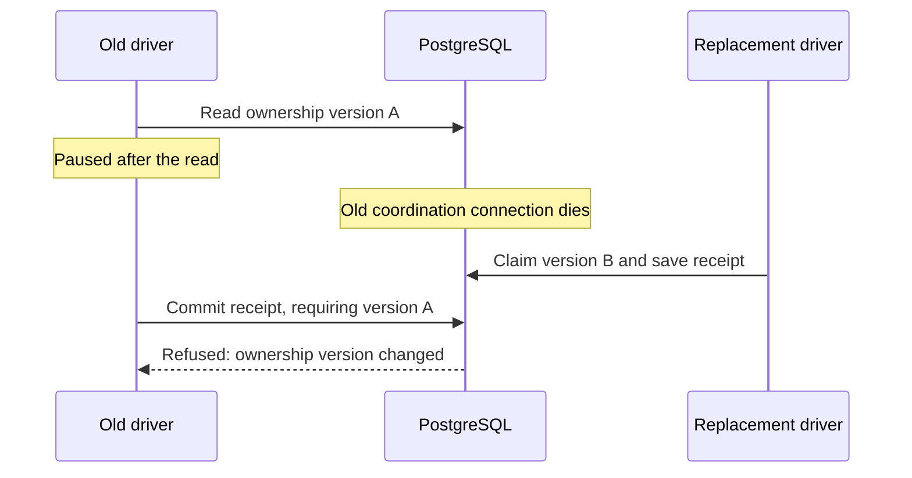

# MemQL self-hosted delivery

This plan supersedes conflicting implementation choices in the October 4
delivery plan. The owner authorized implementation and local testing on
October 5, 2026. Public publication and production deployment require a later
approval of the exact candidate. Do not retire working CI before parity is
measured. Do not add Azure capacity for this work.

## Boundaries

### Cluster update requirements (owner clarification, October 6)

Owners and developers must discover and trigger installation updates from
**Cluster > Updates** in MemQL OS. Local and cloud installations use the same
workflow, authorization and GitOps reconciliation contract; provider-specific
values describe placement, never a second user workflow. Show installed and
available versions independently for engine, Cockpit and editor extensions.
Unchanged components retain their versions. A coordinated release record binds
the selected commits, compatible versions, verified artifact digests and tests.

The review names the exact target and candidate, disruption assessment and
rollback point. The final action starts a durable operation outside the pods
being replaced. Its states include preparing, deploying, verifying, cleaning up,
complete, failed and recovery required; a lost connection is not completion.
Runtime update attention uses the shared OS attention service and remains
distinct from feature-discovery attention. The owner-only public-release gate
is separate from the owner/developer installation-update permission.

Existing rolling replacements are a starting point, not proof of uninterrupted
use. Measure website requests, authenticated requests, active streams and
subscriptions throughout real local and production rolls. New replicas must be
ready before taking traffic; old replicas drain. Verify mixed-version operation
and database migration compatibility before a rolling update is offered. A
single-replica database restart needs an explicit maintenance assessment. No
second Azure cluster, extra node pool or Cilium work is authorized by this plan.

Cleanup is part of every attempt, including cancellation, failure, worker loss,
controller replacement and interrupted rollback. Persist each temporary resource's
ownership and identity before creating it; reconcile uncertain deletion against
the correct target before releasing capacity. Cleanup has durable progress and
bounded retry, and unfinished cleanup prevents a completed deployment verdict.
Never infer ownership from age alone. Preserve the active installation, client
assets, persistent volumes, secrets and a defined rollback artifact set. Verify
temporary pods/Jobs/Secrets, containers, networks, anonymous volumes, build
workspaces, caches/builders and any explicitly created cloud resources against a
before/after inventory. Do not delete shared or unrecognized Azure resources.

The existing deploy-control `Deploy` RPC only transitions a record and rejects
`docker-local`; it cannot serve as the update button's effect. The current
deployment DSL also contains retained historical orchestration. Complete the
runner and GitOps path before exposing a deploy action; do not report an async
record write as a successful update.

### Existing implementation boundaries

- Ship the default CI/CD workflow as sealed core DSL. Clients configure it,
  call its public constructs, or compose separately named workflows. The
  template must not copy the core workflow into each client repository.
- Keep orchestration decisions in DSL; integrations provide bounded effects.
  Change the runtime only for missing general primitives or correctness.
  Audit queries, mutations, specifications, logic and automations while
  implementing the workflow. Record each missing primitive with a non-CI
  use case and an independent regression test. Do not put CI policy in Go
  merely because the present DSL cannot express it.
- Keep independent component versions in one coordinated release record.
  Approval binds commits, artifact digests, evidence and targets; changed
  inputs invalidate it. One approval covers public publication and deployment.
- Keep client values in the instance repository. The template supplies generic
  consumption conventions and upgrade tests.
- Use existing cluster and opted-in Cockpit compute. Portable builds use an
  explicit container contract on either surface; native builds require the
  appropriate host. Preserve repository consent and reserve capacity across
  replicas and across the clusters a worker serves. Queue bounded work when
  suitable capacity is busy. Never infer Docker health from an old label.

## Implementation sequence

- [x] Recover the delivery branch against current main; preserve both histories.
- [x] Resolve merge conflicts and pass compiler, driver, outbound and verifier
  baseline suites (database-backed cases still require separate verification).
- [x] Protect server-authored run/configuration records through a general DSL
  contract; verify direct writes cannot forge evidence (#5822).
- [ ] Restrict inbound/outbound row visibility and verify every legitimate
  reader, writer and subscription (#5802, #5804).
- [ ] Complete runner readiness, egress isolation proof, service-account
  isolation, capacity and recovery cases (#5803, #5810, #5811, #5812, #5821,
  #5823; check newer issue state before implementation).
- [ ] Finish channel management, false-green evidence and rollout verification
  in the existing OS surfaces (#5504, #5505, #5506).
- [ ] Refactor default workflow policy into public core DSL with an explicit
  selection/configuration boundary and a second workflow proving composition.
- [ ] Add candidate preparation, compatible component versions, owner approval,
  artifact provenance and idempotent release/deployment receipts.
- [ ] Reproduce all necessary build/test/security/docs/release lanes for engine,
  Cockpit, SDK, editors, template and instance; classify obsolete lanes with
  evidence before removing them.
- [ ] Update template and instance consumption/configuration, docs and diagrams;
  reconcile already-resolved issues with merged evidence.
- [ ] Test real local cluster execution, multi-replica ownership and recovery,
  Cockpit native/container execution, candidate approval and local rollout.
- [ ] Review the rendered OS in Chrome with desktop/narrow and light/dark
  states. Label fixtures and simulated external services explicitly.
- [ ] Present a working local demonstration and remaining production-only
  checks. Preserve all production gates pending owner review.

## Failure and resource cases

Exercise duplicate/reordered events, cancelled and superseded runs, lost
worker/agent/workbench connections, lease expiry with a surviving old process,
restart during publication, expired credentials, unavailable images, exhausted
disk/CPU/memory, stale hardware reports, occupied capacity, revoked consent,
partial artifact upload, failed health verification and failed rollback.
Confirmed effects are adopted from durable receipts; uncertain publication is
reconciled against the destination before retry. No absence of evidence means
success. Build capacity must leave room for the serving installation.

Recovery is a per-step contract. Reconcile a disconnected worker before
reassigning its work; fence expired attempts so a returning laptop cannot
publish results for its replacement. Use bounded retry budgets and persist
the reason a run stops. Retain completed steps only when their pinned inputs
and durable artifacts still match. A compiler normally restarts; checkpointed
tasks or uploads may resume when their capability supports it. Offer a safe
user resume after exhausted retries without silently repeating uncertain
side effects. Nexus redesign is outside this work.

## Evidence boundaries

Local integration tests may replace GitHub delivery and public publication
endpoints with explicit fixtures, while exercising the real engine, database,
worker and isolated local rollout. They do not prove cloud identity federation,
registry/marketplace permission, native signing, public webhook reachability,
cloud storage behavior or production recovery. Those remain named rehearsal
steps. Time-window milestones #5506–#5509 stay open until observed.

## Generic recovery gaps found during dogfooding

Independent build shards exposed a general language gap: `for` only executed
sequentially, and `parallel` required a statically written branch per item.
`for item in items parallel(16)` now supplies bounded dynamic iteration to
logic and automations. The same form serves document batches and ingestion
tasks. It uses at most the declared number of workers, isolates item scopes,
preserves source indices in execution keys, and joins active children before
the parent finishes. The bound is per loop; cluster and machine capacity
remain the runner's responsibility. Returns inside a parallel iteration are
refused. Ordinary continued errors, fatal journal errors, human waits and
cancellation have separate tests. Nested sequences now honor cancellation
before beginning another statement. This adds no CI-specific construct and
does not yet provide nested recovery or automation ownership fencing.

Recovery now classifies the registered operation and nested logic, loop and
parallel bodies. Known reads and computations may repeat; unknown callees,
external effects and sub-automations require explicit authorization. Query
classification follows registered calls and specifications, refusing unknown
IR, model predicates and unclassified forms. This applies equally to email,
file processing and delivery. Run-private calls remain conservatively refused
by automatic recovery until their scoped registry is included in the proof.

The work dispatcher no longer sets `AllowSideEffects` for automatic recovery.
Its previous justification used `runId:step:attempt`, but resume increments the
attempt, so that key cannot suppress a prior attempt's duplicate effect.
`resume_effect_uncertain` records this refusal; `resume_result_missing` records
a completed producer whose value cannot be recovered. Explicit user-requested
reruns retain their separate authorization path.

Completed unbound effects and skipped decisions are preserved. A saved nil
has an explicit receipt marker, distinct from an omitted result. Missing bound
values from completed effects refuse before reopening the journal; oversized
query results may be reread under replay admission without replacing the
original receipt. They read current state, not a snapshot. Tests cover nested
writes disguised as query calls, unknown executors, preserved prefix effects,
missing values and a nil receipt surviving JSON. The real-database automation
suite passed, including recovery on a separate executor after receipt failure.

The full database-required sweep exposed a second incomplete-read boundary:
Shopify's connector used its UI query, sorted by domain and capped at 100,
as a complete directory. A later store became an unknown webhook source.
Payload-sorted full pages also reported `hasMore: false` despite not proving
exhaustion. The engine now signals a possibly incomplete full page even when
that ordering has no continuation cursor, so the shared page walker refuses
it. The connector uses a separate sealed query in cursor order at one fixed
snapshot and publishes its cache only after traversal succeeds. Its local
cache now honors explicit fresh-read contexts. This is a query-contract fix,
not CI policy. The real uninstall/reinstall and two-engine inbound tests
exercise the consumer boundary; the engine test checks an untraversable full
page against a genuinely exhausted short page.

The Go-driven journal checks all initial writes: goal, run, first heartbeat
and step order, each pending step, and goal activation. Failure at each boundary
refuses admission before a heartbeat loop or command starts.

Still open: the automation executor needs ownership fencing as well as its
required journal and replay admission. The pipeline driver's new fencing is
described below; it does not automatically protect other execution paths.
Destination reconciliation must establish whether an uncertain publication
landed before it can safely repeat. Definition fingerprints still need
engine/bundle pins for transitive callees. No production release may rely on
automatic effect replay until these boundaries are demonstrated.

Self-upgrade must also cross a controller replacement. Persist the approved
candidate and deployment intent before changing the serving engine. ArgoCD
applies the pinned desired state independently; short reconciliation runs on
the replacement observe the same candidate, health evidence and publication
receipts. Do not weaken execution-definition checks to resume an old workflow
under a different engine binary. The first pipeline-capable engine still
requires a controlled bootstrap through the existing delivery path. This
handoff, health failure and rollback remain required end-to-end tests.

## Transactional ownership progress

Each pipeline claim now mints an opaque token, including a restarted process
with the same pod name. A per-run `workjournal.WithWriteGuard` protects initial
writes, queued steps, intents, receipts, bindings, terminal writes and background
heartbeats without changing the shared journal. An unreadable lease refuses
external-call admission. Ending a drive also ends its journal heartbeat.

A separate advisory-lock connection was insufficient: losing that session
releases its lock while the process can survive. The generic engine primitive
`ContextWithRowVersionFence` now compares the observed row version and commits
the protected mutation in one database transaction. It also checks the target's
read-merge version and stamps its replacement after the observed timestamp,
including under clock skew. Fenced critical sections have client and database
time limits; killing the writer connection rolls back the receipt. Claims,
updates and re-staging participate; adapters
must preserve an existing witness instead of refreshing a stale decision.
The context restricts writes and grants no authority. No CI policy is part of
this primitive; non-CI tests use edits and results derived from to-do rows.

Real PostgreSQL tests terminate the old driver's lock backend, let an independent
driver claim and save a result, and prove the returning writer cannot overwrite
it. Separate cases exercise same-node replacement, concurrent decisions, stale
source data, unchanged authorization and clock skew. These are in-process
engine/driver tests over real database connections, not a live two-pod rollout.

All writers of an ownership row must use this protocol. Old engine processes
must be drained before enabling it; a mixed-version fleet of unfenced writers
is not covered. External requests already in flight still need destination
reconciliation. Kubernetes result acknowledgment and the automation executor's
own journal remain separate boundaries to complete.

## Bounded outbound scan progress

The outbound worker advances one page per status per poll and restarts at
exhaustion. Other media, future retries and rows owned by another worker no
longer permanently hide later deliveries. Tests cover independent pending and
retry cursors and leave skipped rows unchanged. The real-row notification
fixture now follows the same pagination and reaches its own rows in a populated
test database. The full baseline exposed these gaps; its remaining corrections
also preserve protected-field tests under operator authority and explain the
cross-owner receipt read's `@serverOnly` contract.

## Child resource-limit isolation progress

Cockpit shell calls now apply limits inside the command's child, preserving
worker limits and those inherited by later pipeline builds. A refused limit
stops before the command. Child start errors no longer produce exit-zero
results, and cancellation kills the process group. macOS race tests and real
Linux/ARM64 execution in an existing local container image verify unchanged
worker limits, a subsequent real pipeline clone/command, policy loosening,
limit refusal and cancellation; Linux also verifies address-space limits.
The container had no network. No installed worker has been upgraded (#484).

## Fleet repository routing progress

Capability descriptors now carry generic, action-specific repository scopes.
Pipeline selection uses them before dispatch; an older or malformed scope is
unknown consent. Cockpit advertises its live allow flag and repository list as
one policy snapshot and re-registers when either changes. The command retains
its independent live-policy check. Cross-replica tests cover skipping a narrow
machine for an eligible one, refusal before dispatch when none accepts the
repository, and missing advertisements. This requires a coordinated Cockpit
upgrade; no existing machine policy has been changed.

## Queued routing progress

The generic workbench router now reports the actual selected replica before
sending a long-running request. Pipeline status prefers that route, with the
existing healthy-peer fallback. This avoids treating another replica's absent
local queue as lost work. An in-process hop through real forwarded handlers
and two real runners verifies one forward for a healthy queue, recovery after
restart or peer loss, and one eventual Kubernetes Job. The API server is a
fixture in these cases; this is not a live two-pod claim. Partitions can still
leave an old request alive, requiring the existing shared-Job deduplication.

## Queued Secret retention progress

Jobs and Secrets now carry the agent's absolute run deadline. Orphan cleanup
uses that deadline plus the outcome TTL, so a shorter workbench ceiling cannot
remove credentials while a step is still queued. Tests cover different agent
and workbench limits, the exact expiry boundary, and bounded cleanup of old or
malformed metadata (#5823).

## Workbench identity progress

The workbench now has `memql-engine-workbench`; only that subject receives the
pipeline Job/Secret Role. Existing custom-domain and package-roll operations
retain explicit grants. Overlay and federation-shape tests pass. A disposable
local namespace test asked the real API server about Job creation and Secret
reads: workbench allowed, shared engine/identity/step accounts denied. Cloud
activation still requires vendor trust preflight. OpenAI's current one-mapping
rule requires an exact two-subject CEL allowlist in the existing mapping, not
a second mapping for the same provider/account pair. The runbooks record the
order; no external trust or deployed workload has been changed.

## Isolation proof progress

The runner now requires a positive connection to the same listener used by
its restricted connector. Both share the listener ingress rule; only the
control has a narrow egress exception. Unit, real shell and rendered-overlay
suites pass. An opt-in test on local k3d created and removed a disposable
namespace and verified four actual CNI cases: normal rules pass; missing
egress fails; a missing IP exception list fails; missing listener ingress is
inconclusive. No running engine Deployment was replaced. This addresses the
ingress-masking failure in #5810; cloud and multi-node rollout remain unverified.

## Delivery privacy progress

Inbound and outbound concepts now declare the cluster-operator row tier.
Named reads, generic row admission and subscriptions reject ordinary users;
internal call origin alone does not grant a read. Package webhook and campaign
feedback handlers use an internal-only, bounded operator lookup. Datasync
retains its operator identity, email-rule staging retains author provenance,
and the outbound drain now uses the shared deployment actor on all auth
surfaces. Real Postgres tests cover those consumers and pipeline notification
receipts, including an operator client being unable to forge a server's sent
receipt. Package, campaign and email-rule suites pass with the test database.

Issues #5802 and #5804 remain open until review/merge and installation-level
verification, including external product-bundle audit surfaces. Direct client
outbox staging now requires operator authority; tree-loaded automations retain
their server-side staging path.

## DSL and runtime gaps found during implementation

| Capability | Evidence | Decision and verification |
| --- | --- | --- |
| Server-authored concepts | Named `@serverOnly` mutations did not protect raw writes to the same concept. | Added general `@serverWritten`, preserving separate read authorization. Real database tests reject client inserts and updates while authorized pipeline writers pass. Parser, annotation documentation and language conformance cases cover the declaration. |
| Required automation records | `component/automations/journal.go` continued after journal failures; the shared driver journal also previously hid failed step writes. | Shared driver-journal writes now return errors. Added opt-in `@journalRequired` for generic automations: require run/step intent, receipts and completion; stop on failed heartbeats; propagate the requirement to descendants. Fault, race and real-database tests cover a fresh executor resuming an unfinished read without repeating a completed read. This is not an external-effect or ownership guarantee. |
| Definition identity on resume | The automation fingerprint covered step IDs/types/conditions, omitting call arguments, nested bodies and execution policy. | Fingerprint the complete serialized definition, excluding source location, caches and top-level prose. Changed definitions and old incomplete fingerprints refuse resume. Tests cover changes to callees, arguments, retry/error/journal policy, nested bodies and input contracts. Transitive callee identity still requires pinned engine/bundle versions in the release candidate. |
| Safe replay | Generic resume guards side effects with `AllowSideEffects`; pipeline recovery has a separate driver. | Reuse the journal and recovery ownership primitives, but replace blanket replay permission with per-effect reconciliation. Validate pinned inputs, artifact availability and uncertain external outcomes before resuming. |
| Default workflow policy | Event-to-mode selection and substantial orchestration currently live in `component/pipelines` and `component/pipelinerun`. | Move the default choices to sealed public DSL; preserve bounded execution, distributed ownership and protocol validation in runtime capabilities. Prove composition with a separately named workflow. |

Remaining generic recovery gaps include ownership fencing, a run interrupted
before its first step intent, a run whose steps completed but terminal receipt
did not, and reconciliation before repeating uncertain effects. Do not turn
an absent record into permission to replay: a different replica may still be
working. Existing parser support for loops, branches, parallel blocks and
retries should be reused before introducing new syntax.

## Bounded query traversal (#5836)

The full database-backed suite at 6c0dbc019 found that a seed sweep returned
exactly 500 user IDs and silently omitted older users. The evaluator already
clamped a requested page to MaxResults, but cursor emission compared that
result with the larger requested window. The engine now uses the same
bounded window for execution, cursor emission and cache identity. No read
ceiling was raised.

`WalkQueryPages` preserves caller authority and visits bounded pages until
exhaustion. It refuses missing continuations, repeated/cyclic cursors, failed
reads/visitors, cancellation and an exhausted explicit page budget. Startup
user sweeps walk the existing server-only query at one fixed `asOf` instant,
using the DSL's existing temporal-read construct. They return no partial
success. Real PostgreSQL regressions cover 601 users, older users, version
churn, inactive users and an update between pages. Pagination and root access
guards pass; the cross-consumer authorization test now lives in the root
module so engine-local `GOWORK=off go vet ./...` also passes. The next full
workspace run remains required after coordinated worker-contract changes.

## Fleet container execution progress

Cockpit 3c69da8 requires explicit native/container execution and platform,
reports `actionContracts["workerHost.pipeline_step"] = 2`, probes the live
Docker daemon, executes a pinned image, and confirms terminal container state
and removal. Multiline secrets travel on container stdin, outside the Docker
client's arguments/environment. The local real-Docker test verifies exact
commit, environment separation, artifacts, masked logs, cancellation and
orphan reconciliation. Focused race tests, the serial Cockpit suite and its
GitHub checks pass. Engine manifest/dispatch wiring now preserves execution, placement and platform
through the compiled plan, cross-replica dispatch and Kubernetes node selector.
Native steps use binary-reported OS/architecture. Fleet workers must advertise
exact action contract 2, checked again on the live connection. Host requirements
do not pass through a container boundary; ordinary fleet containers declare
placement separately. A native Docker requirement receives a live daemon probe.
The OS connect preview carries fleet placement even without host needs and
requires consent; its fleet count excludes unsupported worker contracts.
Focused runner/compiler suites, a database catalog read on another reader,
cross-replica refusal/race tests, Cockpit's full suite and UI tests cover these
paths. Browser and actual two-replica cluster validation remain outstanding.
No installed worker has been upgraded.

One build slot is shared across cluster enrollments and worker processes under
the same OS user. A durable record survives process death. A replacement
reconciles only its recorded container on the original daemon; interrupted
native work, corrupt records and uncertain cleanup remain blocked. Current
container bounds are 2 CPUs, 2 GiB and 512 processes. Services and caches still
refuse on the fleet contract. Agent workloads and other OS users are outside
this reservation; resource admission, native reconciliation and complete fleet
parity remain open. These limits are not evidence of a finished build fleet.

## Receipt acknowledgement and conservative recovery

The executor now retains a completed Job until the driver durably commits its
work-step receipt, then calls the optional `ReceiptAcknowledger` contract.
Journal failures send no acknowledgement. A replacement driver can retrieve
that Job's recorded result without another command or Library publication;
completed journal rows repeat cleanup idempotently. Cleanup retains bounded
retry and TTL behavior.

A resumed unfinished intent carries `recoverOnly` across the mesh. A missing
Job refuses with `pipeline_execution_uncertain` before resource or token
creation; a fleet intent without a durable remote receipt is never redispatched.
The versioned workbench action prevents an older binary silently ignoring this
flag. Real two-runner handler tests (against a fake Kubernetes API), journal
fault tests and focused race/database regressions verify these seams.

This does not finish recovery: an uncertain initial forward needs durable
external-attempt identity and reconciliation, artifacts written before the
final runner outcome need deduplication, and ordinary automation executions
still need ownership fencing. Retention expiry and late delivery must be
included in that generic execution contract. Until those are implemented,
uncertain fleet attempts stop for reconciliation instead of automatic failover.

## Complete execution definitions at recovery

Work journals now fingerprint each complete declaration: call metadata, step
kind and type, dependency graph and order. Unencodable definitions are refused
before any goal or run write. Pipelines record a digest of the command, image,
services, placement/platform, package slice and run inputs, including the driver
engine's immutable source revision and cluster domain. Only the digest enters
the call metadata; resolved secrets and command text do not.

A replacement first restores the original package selection and skip decisions,
then checks every definition and its order. Missing, duplicate, changed and
legacy unproven definitions refuse recovery. Unknown or dirty engine revisions
cannot authorize recovery. Failed-only reruns carry a prior success only with
the same execution definition. Confirmed receipts remain unchanged when an
unfinished run is refused. Two-driver tests cover command/image/engine/domain
changes; focused race tests pass. This binds this pipeline driver's compiled
contract; transitive DSL/bundle identity remains part of the future generic
execution contract, not a claim made by this fingerprint.

Main was integrated at b4be5df2b, preserving both human-question suspension and
required-journal failure propagation. The combined automation suite passes.
The merge conflict had prevented new pull-request CI runs; checks resumed
at 603edce54. The branch remains a draft and no production change is approved.

## Checkpointed human continuation and CI integration

Merging newer Ask work exposed a real interaction: a paused agent turn has an
external effect classification, so the conservative replay guard correctly
refused to restart it. Registered integration capabilities can now implement a
generic checkpoint preparation contract. It is separate from read-only replay
and applies only to the particular waiting step with a persisted human decision.
The agent-turn integration verifies an owner-scoped answered approval and a
content-addressed checkpoint for that exact run and step. Restoration rechecks
the proof and refuses missing, changed or empty checkpoints rather than falling
back to a fresh turn. Other steps do not inherit the continuation requirement.
Unclassified effects, arbitrary wrappers and other agent capabilities still
cannot retry automatically.

A real database test pauses one executor, records an answer, and resumes on a
second executor without repeating the earlier effect. Separate engine instances
verify owner isolation, unanswered/missing proof, wrong step/decision, changed
checkpoint and cancellation. The combined database-backed automation, pipeline,
workbench and agent suites pass; focused race tests cover the contract boundary.
This is a continuation protocol, not a claim that model-generated tool choices
provide exactly-once external effects.

CI found four integration omissions: the cluster test adapter lacked readiness,
the delivery-consumer database regression was outside the database lane, an
agent-wiring fixture omitted explicit execution mode, and the new uncertain
outcome lacked OS copy. These are repaired. The consumer test lives in the
existing provisioned `test/pipelinehop` suite; no database coverage exemption
was added. The integrations module also promotes its used YAML dependency to
a direct requirement. Full branch and local workspace verification remain open.

## Integration evidence and merge preparation (2026-10-05)

The complete database-required workspace run at `cc30648c7` finished. Automation,
pipeline driver, step runner, work journal, Shopify, inbound-hop and pipeline-hop
suites passed. The run was **not green**: it identified companion editor grammar
metadata, two expected diagnostic strings, and the connector query's explicit
internal authorization declaration. Focused runs of every failing gate pass after
those corrections; the complete Shopify and inbound-hop suites also pass again.
VS Code 0.6.3 is prepared for the bounded-loop grammar and has not been published.
The intermittent editor preview timeout is still being investigated; host failures
now retain their logs and report webview delivery state.

Template `memql-project#67` prefixes starter constructs, uses namespace-safe
imports, and checks two stamped projects both separately and together through the
real engine loader. The combined 14-file tree passes against this branch, and
restoring the bare names makes it fail. Released engine v0.24.0 initially failed
the hyphenated combined case because its shape resolver ignored namespace pins.
The final starter uses its identifier-safe namespace as its directory name
(`demo-app` gets `dsl/demo_app/`), so the combined test also passes on v0.24.0
without waiting for an engine release or removing the compatibility check.
Existing client paths and pins are not migrated. The generic engine fix in
`74a70903f` remains necessary for other deliberately pinned or nested domains.

The shared capability metadata checker discovers four template scripts and fifteen
instance scripts. Seven failure controls pass, including a real `promote.sh` copy
modified to emit a second JSON document. Merged instance `memql-znas#175` carries the
same checker. These checks exercise metadata, not external deployment effects.
The earlier unconditional site auto-deploy suggestion in `memql-znas#164` has been
superseded by the owner's exact-candidate approval requirement; change detection,
site/docs build evidence and served-version verification remain outstanding.

The owner requested merging this completed increment and running the merged
code locally. This does not complete the unchecked program above or authorize
public publication or production deployment. Main through the Ask UI changes in
`memql#5838` is included. A CI migration-lock fixture timed out during table
initialization instead of its intended long-running migration; the injected
deadline now applies only to that migration. The three database lock regressions
pass ten repeated runs. Final PR checks and local rollout still need their own
recorded results; earlier green runs are not a claim about the final commit.
