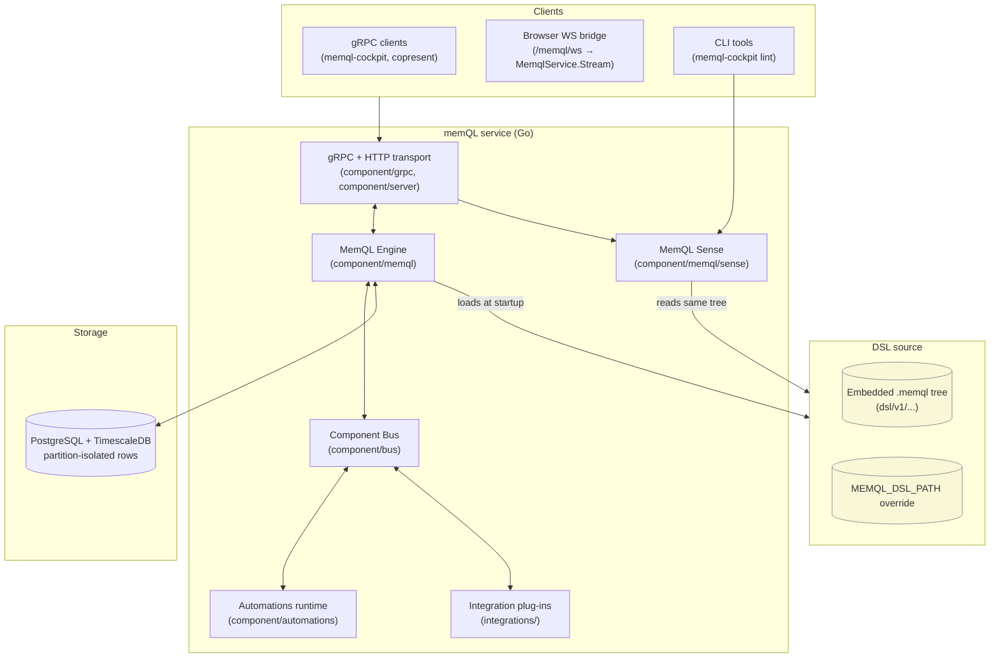
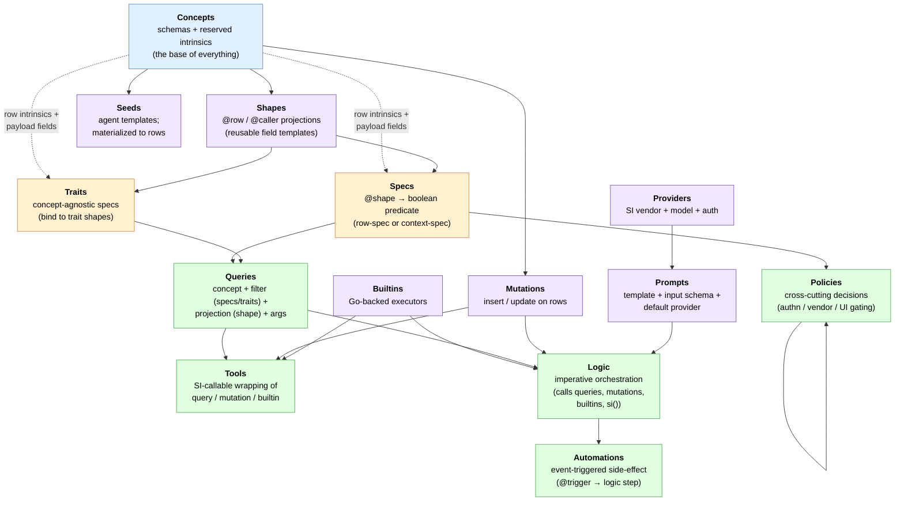
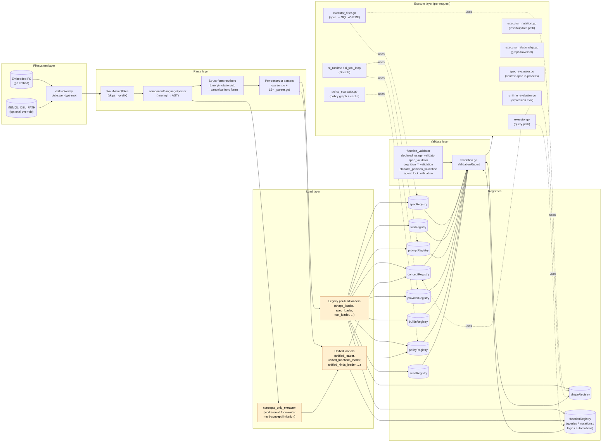
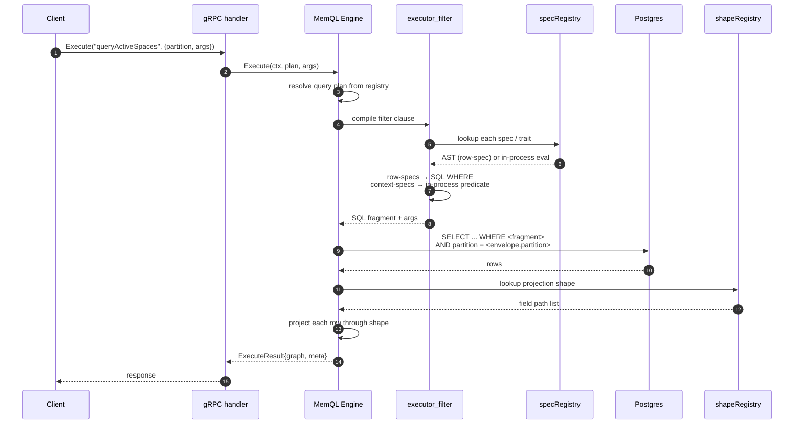
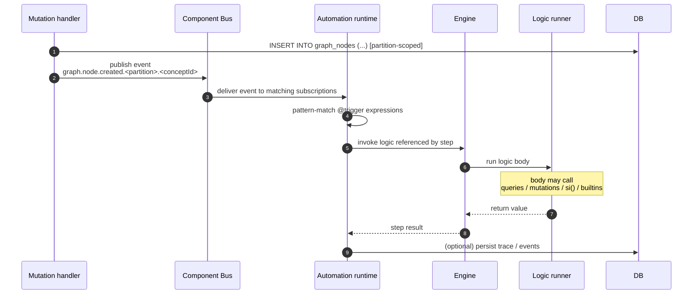
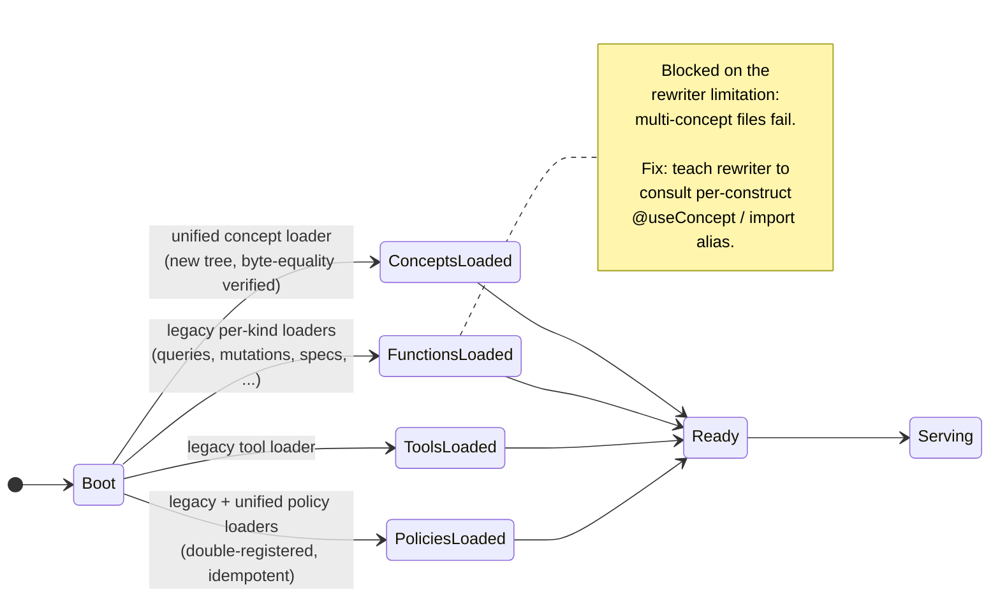

# MemQL DSL + Engine — MVP Foundation Analysis

> **Status:** Foundation analysis ahead of the next feature.
> **Scope:** The DSL author surface (`dsl/`) plus the engine that loads,
> validates, and executes it (`component/memql/`).
> **Goal:** Surface every moving part of the DSL/engine so we can pick
> the rules and hardening that get us to MVP-ready foundation.
> **Audience:** Engineering. Diagrams render as mermaid; the file is
> meant to be read top-to-bottom.

---

## 1. Why this document exists

The MemQL DSL is the user-facing surface of the product. Every feature
the user builds — concept schemas, automations, agent tools, policies —
is authored in `.memql` files. The DSL is therefore not "a query
language we have" but **the entire programming model** the customer
inherits.

That means three constraints have to hold before public release:

1. **Syntactic stability.** Every authoring construct must have one
   canonical shape; legacy variants must error, not silently parse.
2. **Semantic soundness.** Loader, validator, and executor must agree
   on what each construct means. Today there is real tension between
   what `CLAUDE.md` says is canonical and what the loader actually
   tolerates.
3. **Operational predictability.** Errors at parse time must point at
   the offending file:line. The engine must boot deterministically;
   silent fallbacks are not acceptable.

This document captures the current state, the in-flight refactors,
and the punch list of rules we have to lock down before we ship.

---

## 2. The big picture

### 2.1 Where the engine sits in the stack

**The engine is the only thing that reads `.memql` files.** Everything
else (transport, automations, integrations, sense) consumes the
engine's typed registries.

### 2.2 The DSL dependency tree (intended state)

This is what `CLAUDE.md` documents as the authoritative dependency
hierarchy. Each layer references only layers above it; cycles are
load-time errors.

**Reading rules:**

- Solid arrows are "is built on top of."
- Dashed arrows are "references payload/intrinsic fields of" without
  binding via `@useConcept` / `@useShape`.
- Policies can call other policies (downward delegation only —
  `core` → `core`, `bff` → `core`, never `core` → `bff`).

---

## 3. The 15 DSL constructs

Inventory of every construct the DSL supports, with one-line purpose
and current maturity. The "Author shape" column shows what the user
types.

| # | Construct | Purpose | Author shape | State |
|---|---|---|---|---|
| 1 | `concept` | Persistent row schema | `@version @namespace concept N { fields }` | Mature |
| 2 | `shape` | Reusable field projection | `@row / @caller shape N { row.X; payload.Y }` | Mature |
| 3 | `spec` | Atomic boolean predicate | `@shape("S") spec N { <bool-expr> }` | Mature |
| 4 | `trait` | Concept-agnostic spec | `@enabled trait N { <bool-expr> }` | Mature |
| 5 | `query` | Typed read | `query N { args; filter; shape }` | Mature |
| 6 | `mutation` | Typed write (one insert/update) | `mutation N { args; insert { ... } }` | Mature |
| 7 | `logic` | Imperative orchestration | `logic N { args; body { return <expr> } }` | **In-flight** (multi-step landed F.5; not fully integration-tested) |
| 8 | `automation` | Event-triggered workflow | `@trigger(...) automation N { step run { logic ... } }` | Mature for single-step; multi-step recipes in flight |
| 9 | `tool` | SI-callable surface | `@handler(...) tool N { fields }` | Mature |
| 10 | `prompt` | SI template + schema | `@templateFile @defaultProvider prompt N { fields }` | Mature |
| 11 | `provider` | SI vendor config | `@extends @model provider N { params }` | Mature |
| 12 | `builtin` | Go integration wrapped as DSL call | `@executor("integration.X.Y") builtin N { fields }` | Mature |
| 13 | `seed` | Declarative agent template | `@scope("perUser") seed N { fields }` | Mature |
| 14 | `policy` | Cross-cutting decision | `@tier func (Policy) N(ctx any) <T> { ... }` | Mature; **legacy `func (Policy)` form still present** alongside struct form |
| 15 | *(retired)* `agent` | Was a top-level primitive | Replaced by `seed` | Removed |

**Key invariants** (from `CLAUDE.md` and `memql-specifications.md`):

- Every spec **MUST** carry `@shape("...")` binding.
- Every struct-form query/mutation **requires** file-top `use <ns>.<concept>`.
- One `insert` or `update` per mutation body (parser limit).
- `ctx` is gone from the author surface; `args.X`, `actor.X`, `now`,
  `partition`, `config.X` are the only resolvable names.
- Concept names are lowercase-first; concept IDs assemble as
  `v<MAJOR>:<namespace>:<name>` (byte-identical to legacy paths).

---

## 4. The engine internals

### 4.1 Pipeline overview — what happens between `.memql` files and a running engine

**Three things to notice:**

1. **There are two parallel load paths.** Legacy per-kind loaders
   (one per construct type) and a unified loader (Phase 2 of the
   import-model refactor). Today the unified loader only handles
   concepts and a subset of constructs; the rest still flow through
   legacy. The transitional `concepts_only_extractor.go` exists
   purely because the struct-form rewriter chokes on multi-concept
   files. **This is the single biggest soundness risk** until
   Commit 2 of the refactor ships.

2. **Registries are global.** Two files declaring `query foo` collide;
   second-write wins silently. The import-model refactor is the
   planned fix (per-file registries keyed by `(file_path, name)`).

3. **Execution is dual-mode.** Specs that reference `payload.X` /
   intrinsics compile to SQL `WHERE` fragments (push-down to
   Postgres). Specs that reference `caller.X` only evaluate in-process.
   The classifier walks AST field references at load time. Mixed
   bodies are rejected.

### 4.2 Lifecycle of a query

### 4.3 Lifecycle of an automation

### 4.4 Loader transitional state (today)

---

## 5. State of the union — what's solid, iffy, missing

### 5.1 Solid foundation

- **Concept schema model.** `v<N>:<namespace>:<name>` IDs assemble
  deterministically; byte-equality maintained across the import-model
  migration. Row intrinsics (`id`, `createdAt`, `createdBy`,
  `partition`, `schema`, `concept`, `type`) are reserved at parse
  time. 76 concepts loaded clean from the new tree.
- **Spec evaluation dispatch.** Row-spec vs context-spec
  classification works and is correct. Mixed bodies are rejected.
  SQL push-down keeps the read path fast.
- **Argument resolution.** `args.X / actor.X / now / partition /
  config.X` are the canonical names. The ctx-envelope purge
  (F.1–F.7) landed; `ctx.X` is recognized as a synonym during the
  transitional window but every emitted body is canonical.
- **Per-construct annotation allow-lists.** Typos surface at load
  time. There is no silent acceptance of an unrecognized
  annotation.
- **MemQL Sense (LSP service).** Tokenize / Complete / Diagnose /
  Hover / SignatureHelp are in place and exposed via gRPC; lint runs
  clean against the live tree.
- **Strict partition isolation.** Every gRPC envelope is ACL-checked;
  graph subscriptions are server-rewritten so wildcards can't leak
  cross-tenant.
- **Auto-generated architecture model.** `component/architecture`
  produces a typed graph of the codebase; the observe runtime emits
  per-call telemetry against the same identifiers. This is the
  foundation for cockpit drill-down.

### 5.2 In-flight — known and tracked

| Area | What's in flight | Tracking doc | Risk if shipped half-done |
|---|---|---|---|
| Import-model refactor (Commit 2) | Migrate 570+ files from `@useConcept` to `import (...)` blocks; rewrite `@trigger` and `@handler` symbol refs; collapse 654 files to ~65 | `docs/dsl-import-model-refactor.md` | **High.** Until done, two load paths coexist; per-file registries can't replace global ones; multi-construct files break the rewriter. |
| Multi-step Logic execution (F.5) | Step-runner integration with `LogicRunner` | `docs/handoff-ctx-purge.md` (closed) | Medium. Logic blocks that need intermediate steps fall back to single-statement form today. |
| Planner orchestrator | 7 remaining tasks (cognition triage, lazy embedding, entity-schema inference, dedup, token budget, community gating, NemoClaw wiring) | `docs/PLANNER_TODO.md` | Medium. Schema is in place; only the orchestrator goroutine is missing. |
| MemQL Sense import awareness | Cross-file go-to-definition + autocomplete after import-model refactor | `dsl-import-model-refactor.md` "Open items" | Low for MVP; reduces author velocity if missing. |

### 5.3 Iffy — design tension or rule not yet locked

| Theme | What's unclear today | Why it bites at MVP |
|---|---|---|
| **Spec/policy boundary** | A pure caller-only policy gets a migration nudge to become a spec. The rule is one-way (policy → spec) but the line is informal: "no policy-only annotations." | If a customer writes a policy that's "almost a spec" the engine will reject at load time with a wall-of-text error. Need a single sentence the docs can cite. |
| **Mutation single-write rule** | One `insert` or `update` per body is a parser limit, not a design decision. Users writing a "create-and-grant" want one mutation. | Workaround today: write an automation that fires on insert and runs the grant. Users won't know that pattern. Either lift the limit or document the pattern as Rule #1. |
| **Logic vs Automation** | Both can sequence calls. Logic is invoked by automation; automation is invoked by event. But "what should be a logic vs what should be an automation" is informal. | Users will mix them up. The rule "logic = pure function, automation = event-bound side-effect" needs to be enforced (validator). |
| **Naming conventions** | Doc says `query*`, `mutation*`, `spec*` prefix with lint warnings. But traits and shapes and tools have informal conventions only. | Inconsistency on the surface the user sees first. |
| **Tool handler reference** | `@handler(type="query", query="qName")` accepts a bare name. With the new import model it becomes a symbol ref. Both still work. | Migration window risk: docs and the rewriter need to converge on one form. |
| **Reserved identifiers** | List lives in `component/memql/keyword_slices.go` and `dslimports/symbols.go`. No doc index. | Author typing `now: 1` in a payload gets a confusing error. Index belongs in docs. |
| **Concept versioning** | `@version(1)` is on every concept; `v2` migration story exists in `concept-versioning.md` but is untested in production. | Locks the schema-evolution story before customers start authoring. |
| **Trait shape namespacing** | Trait shapes (concept-agnostic `@row` shapes) live under `common/`. The pattern works but isn't enforced. | A customer authoring outside `common/` can declare a trait shape anywhere — silent. |
| **Seed materializer races** | Recent fixes for "silent mutation-parse failure" and "spacing racing engine start" landed without regression tests. | Quiet regressions are the worst kind. |
| **Policy lint vs runtime check** | `make policies-lint` runs the loader, which is the engine's check. There's no separate static lint. | Authors who skip `make policies-lint` get the same error at engine startup. Acceptable for now; flag it. |

### 5.4 Missing — gaps the punch list has to cover

1. **Test coverage for the parsing chain.** Eight per-kind parsers
   (`automation_parser`, `logic_parser`, `query_parser`,
   `mutation_parser`, `prompt_parser`, `provider_parser`,
   `shape_parser`, `policy_parser`) have no `*_test.go` companions.
   Function-loader tests cover some paths transitively; the rest
   ride integration coverage only.
2. **End-to-end smoke for multi-step Logic.** F.5 landed; 13 logics
   are now unblocked. No documented cluster boot + golden-path run
   verifying every logic loads and fires.
3. **Unified loader + legacy loader divergence test.** No test asserts
   that the merged registry from both paths is consistent with the
   single-path baseline.
4. **Validator coverage for domain rules.**
   `cognition_*_validation.go` and `platform_partition_validation.go`
   carry production rules with sparse tests.
5. **Operator capability slug catalog.** `operator_caps.go` defines
   the headless/embodied capability split but isn't surfaced in a
   doc index.
6. **Doc index of reserved identifiers + annotations.** Today the
   author finds these by failing the loader.
7. **DSL formatter (`memqlfmt`)** exists but I haven't verified it
   produces the same canonical form the rewriter emits. If they
   disagree, formatter-applied files will diff against rewriter
   output.

---

## 6. The rule set we should lock for MVP

Concrete proposed rules. Each is something the engine should enforce
loudly (not silently tolerate) before public release.

### Authoring rules

1. **One canonical form per construct.** Reject every legacy form
   at parse time. No more `func (Spec)`, `func (Provider)`,
   `func (Tool)`, `@input` wrapper, `ctx.X` synonym after the
   purge window. Errors must point to the file:line and emit the
   migration nudge.
2. **Imports are the only cross-file mechanism.** Once Commit 2 of
   the import-model refactor lands, `@useConcept(...)` and raw
   concept-ID strings in attribute values are errors. No silent
   fallback.
3. **Spec binding is mandatory.** Every spec carries `@shape(...)`.
   No `@shape` → load-time error, not a warning.
4. **Mutation single-write is documented as Rule #1.** Or lift it.
   Picking one removes the most common authoring confusion.
5. **Naming prefix is enforced for code-gen / lint.** `query*`,
   `mutation*`, `spec*` are non-fatal warnings today; promote to
   errors under strict mode and make strict mode the default for
   the engine's startup validator.
6. **Reserved-identifier shadowing is a hard error.** Names in
   `keyword_slices.go` plus `now`, `actor`, `partition`, `config`,
   `trace` cannot be used as field names or arg names.
7. **Unused imports / unused args are errors.** The rewriter
   already enforces unused args; extend to imports once the
   refactor lands.
8. **Concept names are lowercase-first; concept IDs are derived,
   never written.** No `v1:cognition:participant` strings on the
   authoring surface (per the import-model refactor).

### Validator rules

9. **CQS enforcement is final.** Queries cannot mutate. Specs
   cannot mutate. Mutations cannot mutate (no nested mutations).
   Today this is enforced in the executor; lift it to the loader.
10. **Declared-but-unused is a warning by default, error under
    strict mode.** Specs / shapes / tools / builtins that nothing
    calls are dead code. Surface them.
11. **Policy tier is a hard partition.** `core` must not call
    `bff`. `bff` may call `core`. Cyclic policy graphs are
    rejected. Today the lint exists; promote to a startup gate.
12. **No two construct kinds may share a registry name.** A query
    and a mutation called `foo` is an error. The import-model
    refactor's per-file registry makes this easier; lock it in.

### Engine rules

13. **Startup is fail-loud.** Any validator error fails the
    process. No "silent skip with log line."
14. **Two loaders coexisting is a transitional state with an
    expiry date.** Commit 3 of the refactor deletes the legacy
    path. Put the date in the refactor doc and respect it.
15. **Every parser, executor, validator gets a unit test before
    the file ships.** Backfill the 8 missing parser tests as
    Phase 1 of MVP hardening.
16. **Smoke test the live tree on every commit.** `memql-cockpit
    lint dsl/` returns 0 diagnostics on every commit. CI gate.

---

## 7. MVP hardening punch list — status as of branch landing

Sequenced; each step is independently shippable. The
`feature/dsl-mvp-foundation` branch landed the items marked `[x]`
below; items left as `[ ]` are queued for follow-up branches
(typically because they need running infrastructure or are part
of the broader Commit 2 file sweep).

### Phase 0 — guardrails (1 week)

- [x] Add unit tests for the eight parser files. One golden-path
      test per construct, plus negative tests for the legacy forms
      that we want to reject. (commit `8b42c20`)
- [x] CI gate: `go test ./...`, `go build ./...`, `go vet ./...`
      run on every PR via `.github/workflows/ci.yml`. (commit `cef02a8`)
- [ ] CI gate: `memql-cockpit lint dsl/` -- wired as a disabled
      placeholder; flip to true once the cockpit binary is
      installable on the runner.

### Phase 1 — finish the import-model refactor (2–3 weeks)

- [x] Teach the loader's payload-translation pass to handle
      multi-construct files. The rewriter already had per-construct
      binding via extractConceptBindingForBlock; the loader's
      file-level `translateConceptPathsToPayload` was the actual
      blocker. (commit `d6d1190`)
- [x] Stage migration progress reporting:
      `scripts/audit-import-model` (commit `bbbc2d8`).
- [ ] Run the mechanical 570-file sweep. The byte-equality audit
      against production concept IDs is **not required** -- the
      project hasn't deployed yet, so the migration starts fresh.
      Stage in a follow-up PR (touches ~570 .memql files, separate
      review scope from this PR's code/test changes).
- [ ] Land Commit 3 of the refactor: reject legacy forms; delete
      transitional shim code; delete `concepts_only_extractor.go`;
      collapse to one loader path.
- [ ] Update CLAUDE.md and authoring-rules.md to reflect the new
      surface as the only surface.

### Phase 2 — lock the rules (1 week)

- [x] Promote naming-prefix warnings to errors under strict mode;
      make strict mode the default at engine startup. No escape
      valve -- fresh-start project. (commit `d98d07f`)
- [x] Loader-side CQS enforcement (was executor-side only).
      Per-file ValidateCQS + cross-registry validator at engine
      startup. No escape valve -- fresh-start project.
      (commit `6feda17`)
- [x] Formalize the policy/spec migration rule (Decision 2):
      annotation-based rejection with precise migration message.
      (commit `56f391a`)
- [x] Doc index of reserved identifiers + annotations
      (`docs/core/memql-reserved.md`). (commit `c136318`)
- [x] Doc index of capability slugs
      (`docs/core/operator-capabilities.md`). (commit `c136318`)
- [x] Rule #1 (mutation single-write) documented as the
      foundational rule in `docs/core/memql-authoring-rules.md`,
      with the workspace bootstrap pattern as the worked example.
      (commit `c136318`)

### Phase 3 — close the in-flight loops (2–3 weeks)

- [ ] End-to-end smoke test for multi-step Logic (cluster boot + at
      least one cycle of every logic block). Requires a running
      cluster; queue alongside the broader integration-test work.
- [ ] Planner orchestrator goroutine: take the seven PLANNER_TODO
      items to completion. **Out of scope** for the foundation
      branch -- own feature.
- [x] Regression tests for the seed-materializer fixes (3609391,
      99825ea) already shipped with the original fix commits;
      verified in place.
- [x] Validator coverage for `platform_partition_validation` (8
      cases) and `cognition_action_validation` (8 cases).
      (commit `c9b4360`)

### Phase 4 — surface polish (1 week)

- [x] Confirm `memqlfmt` output matches rewriter output (parity
      tests for query / mutation / logic). Idempotency also
      asserted. (commit `2d47674`)
- [ ] MemQL Sense import-awareness (go-to-definition,
      cross-file autocomplete). Blocked on import-model refactor
      Commit 3.
- [ ] Cockpit drill-down for the live observability runtime
      (already shipped; verify against the new tree).

---

## 8. Locked decisions (2026-05-19)

Three rules that were open at draft time, locked in this session:

### Decision 1 — Mutations keep the one-write rule

One `insert` or `update` per mutation body. Multi-write flows
compose via automations that fire on the first row's creation and
chain additional mutations.

- Document as **Rule #1** in `docs/core/memql-authoring-rules.md`.
- Ship a canonical "compose" example: the
  `bootstrapWorkspaceOwnerAccess` pattern (currently aspirational
  in `createPartition.memql`) becomes the worked example for
  "create + grant" flows.
- The CQS purity argument is the *why*: every mutation is a single
  observable write, audit trail is per-row, ordering is explicit.

### Decision 2 — Policy/spec boundary is annotation-based

A policy whose body has **none** of `@audited`, `@cacheable`,
`@traces_persisted`, `@frontend_visible`, **and** zero `policy(...)`
sub-calls **must** be authored as a spec. The loader rejects with
a precise migration message naming the target file path.

- Encoded in `component/memql/spec_validator.go` (extend, don't
  add new file).
- Error message format:
  `policy "<name>" has no policy-only annotations and no sub-policy
  calls; author as a spec instead. Move to dsl/v1/specs/<ns>/<name>.memql,
  change receiver to "spec", and replace policy("<name>") calls with
  spec("<name>").`
- Documented in `docs/core/memql-specifications.md` § "Migration
  nudge from policies" with the exact rule wording.

### Decision 3 — Naming strict mode is default ON, no escape valve

Engine starts strict; naming mismatches (`query*` / `mutation*` /
`spec*` prefix violations) fail the load. **No env var escape
valve** -- the project starts fresh under the rule, with no
deployed state to migrate.

- Error message must include the suggested rename, e.g.:
  `function "getUserById" violates naming.query-prefix: Query
  functions must use "query" prefix; rename to "queryUserById"`.

---

**Living document.** Update as decisions land. When the punch list
is complete, this file gets archived (or deleted, per the
no-stale-docs convention) and CLAUDE.md becomes the canonical
authoring reference.
